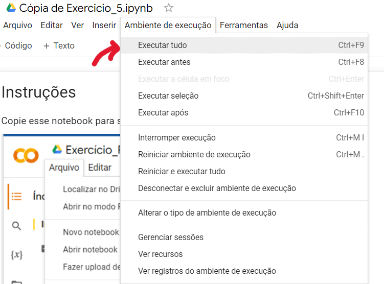
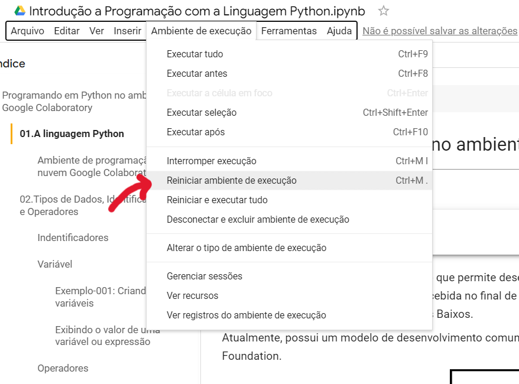
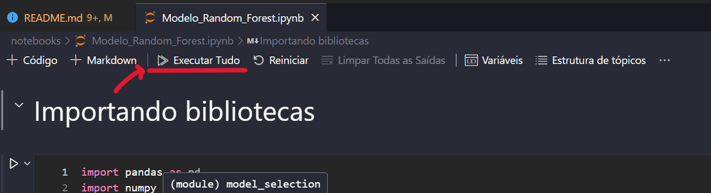
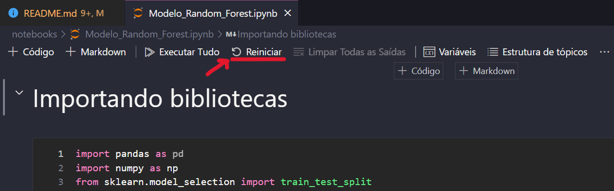
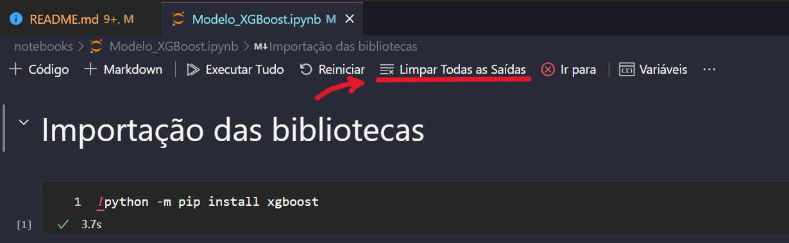

# Inteli - Instituto de Tecnologia e Liderança

# SalesAhead

## Horizon

## 🧑‍🎓Integrantes:

- [Caio de Paula](https://www.linkedin.com/in/caio-teixeira-paula/)
- [Guilherme Linhares](https://www.linkedin.com/in/guilherme-ferreira-linhares-8638411a1)
- [Luiza Rubim](https://www.linkedin.com/in/luiza-rubim)
- [Nicollas Batista](https://www.linkedin.com/in/nicollas-isaac/)
- [Pedro Lima](https://www.linkedin.com/in/pedro-henrique-oliveira-lima-a6a766214/)
- [Raissa Melo](https://www.linkedin.com/in/raissa-vieira-de-melo)

## 🧑‍🏫Professores:

### Orientador(a)

- [Julia Stateri](https://www.linkedin.com/in/juliastateri/)

### Instrutores

- [Claudio André](https://www.linkedin.com/in/claudio-andr%C3%A9-64911a1b5/)
- [Fernando Nobre Koren](https://www.linkedin.com/in/nobrekoren/)
- [Henrique Paiva](https://www.linkedin.com/in/henrique-mohallem-paiva-6854b460/)
- [Jefferson Silva](https://www.linkedin.com/in/jefferson-o-silva/)
- [Rafael Jacomossi](https://www.linkedin.com/in/rafael-jacomossi-6135b0a1/)

## 📝 Descrição

O objetivo do projeto realizado pelo grupo Horizon é antecipar as compras de SKUs com base nas previsões de vendas dos produtos da Mobly para um período de 90 dias. Isso visa melhorar a gestão de estoque e impulsionar as vendas da Mobly. Espera-se alcançar uma assertividade de 90% nas previsões ao longo de uma semana durante esse período ou de 70% em previsões específicas para um único dia.

## 📁 Estrutura de pastas

Dentre os arquivos presentes na raiz do projeto, definem-se:

<pre>

├───documentos
        └─── outros
├───notebooks
        └───dados
</pre>

- **readme.md** : arquivo que serve como guia e explicação geral sobre o projeto (o mesmo que você está lendo agora).
- **documentos** : aqui estarão todos os documentos do projeto. Há também uma pasta denominada **outros**  onde estão presentes documentos complementares.
- **notebooks** : todos os Jupyter Notebooks criados na plataforma Colab para desenvolvimento do projeto.
- **dados** : toda base de dados usada para o projeto estão armazenadas dentro dessa pasta.

## 💻 Execução do projeto

> Vale ressaltar que dentro dos modelos preditivo, bastar executar todas as células do caderno do modelo, em si, pois o pré-processamento é executado automaticamente.

### Execução no Google Colaboratory

> Para **executar** um notebook de forma mais rápida, clique em ambiente de execução e aperte em ``Executar tudo``.
> Ou aperte as tevls ``Ctrl``  + ``F9``  .
>>
>
> Para **recarregar** todo o ambiente de trabalho, vá em ``Ambiente de execução`` e aperte em ``Reiniciar ambiente de execução``.
> Ou aperte as teclas ``Ctrl``  + ``M``  + ``.``  .
>>

### Execução no Visual Studio Code

> Para **executar** um notebook de forma mais rápida, clique em ambiente de execução e aperte em ``Executar tudo``
>>
>
> Para **resetar** todas as células do projeto, bastar apertar o botão de ``Reiniciar``
>>
>
> Para **limpar as saídas** das células, bastar clicar no botão ``Limpar Saídas``
>>

Vale ressaltar que os cadernos possuem comandos para executar os cadernos de sua dependência de execução.

### [Vídeo que exemplifica a execução do projeto no VSCode](https://youtu.be/C9lRPtksQLI)

## 🗃 Histórico de lançamentos
- 0.5.2 - 02/10/2023
  - Correção documentação
- 0.5.1 - 27/09/2023
  - Ajustes do modelo
  - Correção do Read.me
- 0.5.0 - 25/09/2023
  - Preparos finais do modelo final e documentação
- 0.4.2 - 18/09/2023
  - Implementação de algorítimos de otimização
- 0.4.1 - 15/09/2023
  - Busca de hiperparâmetros
- 0.4.0 - 12/09/2023
  - Apresentação de modelos candidatos
- 0.3.0 - 05/09/2023
  - Modelando máquina de aprendizado
- 0.2.3 - 26/08/2023
  - Gerando hipóteses
- 0.2.2 - 23/08/2023
  - Pré-processamento de dados
    - Remoção de colunas e outliers
    - Normalização e Codificação
  - Correções da sprint 1
- 0.2.1 - 18/08/2023
  - Geração de gráficos
- 0.2.0 - 16/08/2023
  - Exploração de dados
- 0.1.2 - 11/08/2023
  - Personas
  - Jornada do Usuário
- 0.1.1 - 7/08/2023
  - Políticas de Privacidade
- 0.1.0 - 5/08/2023
  - Entendimento do problema
    - Análise SWOT
    - Matriz de Risco
    - 5 Froças de Porter
    - Value Proposition Canvas
- 0.0.1 - 01/08/2023
  - Início do projeto

## 📋 Licença/License

<a property="dct:title" rel="cc:attributionURL" href="https://github.com/2023M3T9-Inteli/grupo3">Horizon</a> by <a rel="cc:attributionURL dct:creator" property="cc:attributionName" href="https://github.com/2023M3T9-Inteli/grupo3">Inteli, Caio Teixeira de Paula, Guilherme Ferreira Linhares, Luiza Souza Rubim, Nicollas Isaac Queiroz Batista, Pedro Henrique Oliveira Lima, Raissa Vieira de Melo</a> is licensed under<a href="http://creativecommons.org/licenses/by/4.0/?ref=chooser-v1" target="_blank" rel="license noopener noreferrer" style="display:inline-block;">CC BY 4.0</a>

## 🎓 Referências

Aqui estão as referências usadas no projeto:

1. [https://creativecommons.org/share-your-work/](https://creativecommons.org/share-your-work/)
2. [https://www.figma.com/](https://www.figma.com/)
3. [https://thispersondoesnotexist.com/](https://thispersondoesnotexist.com/)
4. [https://www.python.org/](https://www.python.org/)
5. [https://pandas.pydata.org/](https://pandas.pydata.org/)
6. [https://seaborn.pydata.org/](https://seaborn.pydata.org/)
7. [https://matplotlib.org/](https://matplotlib.org/)
8. [https://plotly.com/graphing-libraries/](https://plotly.com/graphing-libraries/)
9. [https://scikit-learn.org/stable/](https://scikit-learn.org/stable/)
10. [https://numpy.org/](https://numpy.org/)
