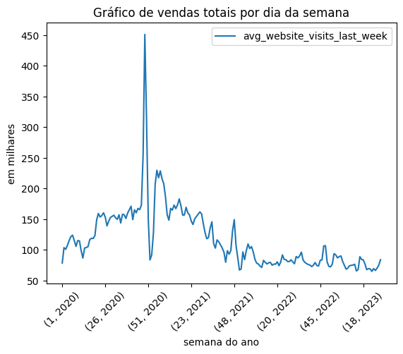

# Documentação Modelo Preditivo - Inteli

## SalesAhead

### Horizon

#### <a href="https://www.linkedin.com/in/caio-teixeira-paula/">Caio de Paula </a>, <a href= "https://www.linkedin.com/in/guilherme-ferreira-linhares-8638411a1">Guilherme Linhares </a>, <a href= "https://www.linkedin.com/in/luiza-rubim">Luiza Rubim </a>, <a href= "https://www.linkedin.com/in/nicollas-isaac/">Nicollas Batista </a>, <a href= "https://www.linkedin.com/in/pedro-henrique-oliveira-lima-a6a766214/">Pedro Lima </a> e <a href= "https://www.linkedin.com/in/raissa-vieira-de-melo">Raissa Melo </a>

## Sumário

[1. Introdução](#c1)

[2. Objetivos e Justificativa](#c2)

[3. Metodologia](#c3)

[4. Desenvolvimento e Resultados](#c4)

[5. Conclusões e Recomendações](#c5)

[6. Referências](#c6)

[Anexos](#attachments)

## <a name="c1"></a> 1. Introdução

   A Mobly é uma empresa brasileira de comércio eletrônico focada em móveis e decoração para o lar. Fundada em 2011, ela se tornou uma das principais plataformas de varejo online do Brasil, com sua sede localizada em São Paulo capital. A empresa atua na venda de uma ampla variedade de produtos, incluindo móveis para diversos cômodos da casa, além de itens de decoração, acessórios e artigos relacionados.
   A Mobly ocupa uma posição relevante no mercado de comércio eletrônico de móveis e decoração no Brasil, sendo reconhecida por oferecer uma vasta seleção de produtos de diferentes estilos e faixas de preço. Seu posicionamento se baseia em fornecer uma plataforma conveniente para os clientes encontrarem e adquirirem produtos para tornar seus espaços mais aconchegantes e estilosos.
   
   Apesar disso, a Mobly encontra-se com uma dor a ser solucionada, pois o seu algoritmo de recompra atual utiliza base histórica, alguns inputs manuais e forecast de vendas para sugerir a compra de produtos para estocagem. Tal método não se torna muito eficaz para uma empresa de grande porte, pois tem como consequência produtos com baixo giro em estoque e a ruptura (falta do produto em estoque), tornando as compras para estoque ineficientes.

## <a name="c2"></a> 2. Objetivos e Justificativa

### 2.1 Objetivos

   O projeto tem como objetivo principal criar um modelo preditivo que auxilie a recompra de estoque da Mobly. A empresa espera aumentar suas vendas com um estoque mais assertivo para as demandas a partir do modelo criado. Além disso, há a expectativa de reduzir os custos de armazenamento, visto que a predição contribuiria para um maior giro de estoque.

   Em relação aos objetivos específicos, é esperado um algoritmo cuja previsão de SKUs (Stock Keeping Unit) vendidos num espaço de 90 dias tenha uma acurácia de 90% por semana e de 70% por dia, a partir de variáveis fornecidades pelos parceiros, como histórico de compras, bem como fatores externos, como sazonalidade e comparação de preços em outros sites.

### 2.2 Proposta de solução

O modelo SalesAhead (SA) consiste na implementação de um modelo preditivo dedicado à otimização da gestão de estoque da Mobly. Este modelo faz uso dos dados fornecidos pela empresa, bem como de variáveis adicionais, como a cotação do dólar, a taxa Selic, a quantidade de visitas ao site e a quantidade de itens vendidos por região. O objetivo principal é prever com precisão a quantidade de vendas por SKU ao longo de um período de 90 dias, permitindo uma gestão de estoque mais eficaz e adaptável às flutuações de demanda. Com uma visão estendida, o sistema realiza previsões diárias e semanais para auxiliar na tomada de decisões estratégicas e manter os níveis de estoque alinhados com as necessidades do mercado.

### 2.3 Justificativa

   Visando uma melhora do sistema de estoque, a fim de otimizar vendas e entregas de produtos para a Mobly, o grupo Horizon está desenvolvendo um modelo preditivo capaz de estimar a quantidade de itens vendidos de cada produto. Nosso modelo será capaz de realizar uma previsão para um período de 90 dias, tanto numa predição de vendas de produtos na semana quanto diariamente. Para a previsão semanal, espera-se uma acurácia de 90%, enquanto para as previsões diárias uma acurácidade 70%.

   Além disso, nosso modelo trará parâmetros externos de suma importância para a previsão. Dentre esses estão o preço do dólar e a taxa Selic, sem contar com os fatores internos, que são os números de vendas de SKUs.
   Tudo isso permitirá que os estoques tenham um maior giro de produtos, diminuindo as chances de danificar itens, além de otimizar espaços, reduzindo custos de estocagem. Outro benefício se dá pela redução do tempo de entrega de produtos, uma vez que mantém produtos suficientes armazenados para a pronta entrega, melhorando a imagem da Mobly com seus clientes.

## <a name="c3"></a> 3. Metodologia

   O método Cross Industry Standard Process for Data-Mining, também conhecido como CRISP-DM, trata de um processo estruturado de planejamento de mineração de dados e análise de projetos _(Gonzalez, Matheus. Jun 23, 2019)_. Ele é composto por seis etapas principais: entendimento do negócio, entendimento dos dados, preparação dos dados, modelagem, avaliação e implementação. O CRISP-DM é um método iterativo, o que significa que as etapas podem ser repetidas várias vezes antes de finalizar o projeto. Ele também é altamente flexível, permitindo que os usuários adaptem o processo às suas necessidades específicas.

   No contexto deste projeto, o método CRISP-DM parte inicialmente da fase de entendimento do negócio. Nesse estágio, são contemplados os objetivos e requisitos do projeto, bem como uma compreensão profunda do cenário industrial, a análise SWOT, o canvas de proposta de valor, entre outros aspectos. Essa etapa se mostra essencial para direcionar o desenvolvimento do modelo preditivo de acordo com as necessidades da empresa e do usuário final, garantindo uma sólida compreensão das regras de negócio e da estrutura organizacional da empresa.

   A segunda fase se concentra na compreensão das informações, abrangendo a coleta, descrição e exploração dos dados. A análise exploratória desempenha um papel crítico nessa etapa, permitindo a identificação de padrões iniciais, tendências e eventuais questões relacionadas à qualidade das informações.

   Na terceira etapa, ocorre a preparação dos dados, envolvendo a seleção, limpeza e transformação das informações, tornando-as adequadas para a fase subsequente de modelagem.

   A quarta etapa, a modelagem, engloba a escolha e aplicação de técnicas de modelagem específicas, bem como a avaliação e seleção dos modelos resultantes. Diversas abordagens, como regressão, árvores de decisão, redes neurais e algoritmos de agrupamento, podem ser aplicadas nesse estágio do processo.

   A quinta etapa, a avaliação, consiste em uma análise crítica dos resultados obtidos após a modelagem, incluindo a revisão de eventuais problemas identificados. Além disso, essa etapa é essencial para garantir que o projeto permaneça alinhado com os objetivos de mercado da empresa, verificando se o modelo produzido atende aos requisitos do negócio.

   Por fim, a sexta etapa, a implementação, transforma os insights obtidos em ações concretas. O modelo selecionado é implementado no ambiente operacional, e os resultados começam a ser monitorados em tempo real.

   Em suma, o método CRISP-DM apresenta uma sequência de etapas que podem ser adaptadas para atender às necessidades de cada projeto. Ele oferece uma estrutura flexível e iterativa para o desenvolvimento de projetos de mineração de dados, permitindo que os usuários se concentrem em cada etapa de maneira organizada e eficiente. Para o projeto em questão, o método CRISP-DM foi utilizado para orientar o desenvolvimento do modelo preditivo da Mobly, garantindo uma organização otimizada na manipulação dos dados necessários, uma análise precisa do mercado de venda de móveis fazendo o uso de ferramentas de negócios e que cada etapa fosse executada de maneira eficaz e os resultados fossem entregues de acordo com objetivos estabelecidos.

## <a name="c4"></a>4. Desenvolvimento e Resultados

### 4.1. Compreensão do Problema

#### 4.1.1. Contexto da indústria

   Entender o contexto em que uma indústria opera é fundamental para qualquer negócio que deseja prosperar em um ambiente competitivo. Ao dissecar os aspectos essenciais deste contexto, é possível identificar oportunidades, entender desafios e traçar estratégias mais eficazes. A seguir, analisamos o mercado de móveis e decoração sob quatro perspectivas principais: os players dominantes, os modelos de negócios emergentes, as tendências atuais, e as 5 forças de Porter. Esses pontos não apenas proporcionam um panorama do mercado, mas também oferecem insights valiosos sobre como navegar e se posicionar de maneira mais eficaz dentro deste ecossistema.

   **Principais Players:**

   No mercado de móveis e decoração, diversos atores desempenham papéis cruciais no atendimento às necessidades dos consumidores. Desde empresas consolidadas até associações regionais, cada uma delas oferece uma abordagem única e valiosa para os clientes. Abordaremos aqui alguns dos players mais proeminentes que moldam a paisagem dessa indústria.

- Empresas de produção e marketplace: Amazon, Americanas, Mercado Livre e MadeiraMadeira.
- Empresas especializadas em móveis: MadeiradoDecor, Tok&Stok, Club Mobili, MadeiraMadeira e SignCasa.
- Associações regionais de produtores de móveis: Por exemplo, a associação regional de produtores de móveis de São Bernardo.

  **Modelos de Negócio:**

  Dentro da indústria de móveis, vários modelos de negócio emergiram para atender às demandas diversificadas dos consumidores. Seja através de plataformas agregadoras, vendas diretas ou serviços personalizados, cada modelo tem suas próprias características e benefícios. Nesta seção, exploraremos os diferentes modelos que compõem o ecossistema deste mercado.
- Venda Direta de Móveis: Empresas como a Mobly que vendem ou produzem móveis diretamente para os consumidores.
- Marketplace: Plataformas que reúnem diversos vendedores em um único local, como Amazon e Mercado Livre.
- Aluguel de Móveis: Alternativa para quem não quer comprar móveis permanentemente.
- Serviços de Decoração para a Casa: Empresas que fornecem o serviço de decoração completa para apartamentos.
- Vendas Personalizadas: Empresas de pequeno porte que oferecem móveis feitos manualmente e sobre demanda.
- Associações Regionais: Grupos de produtores que se unem para fortalecer sua posição no mercado (Exemplo: A associação regional de produtores de móveis de São Bernardo).

  **Tendências:**

  Com o passar do tempo, o mercado de móveis e decoração experimentou várias mudanças, impulsionadas tanto pelos avanços tecnológicos quanto pelas mudanças nas preferências dos consumidores. Novas tendências surgem constantemente, refletindo as demandas e expectativas em constante evolução dos clientes. Aqui, vamos nos aprofundar nas tendências atuais que estão moldando o futuro da indústria.
- Aluguel de Móveis: Como uma alternativa emergente à compra, o aluguel de móveis está se tornando popular.
- Personalização: Os consumidores estão buscando itens mais personalizados, o que dá vantagem aos fornecedores que produzem itens personalizados.
- Poder de Barganha: Com muitas opções no mercado, os consumidores têm mais poder de barganha do que antes, enquanto os fornecedores de itens populares têm menos poder devido à abundância de opções.
- Concorrência Intensa: A presença de grandes marketplaces e empresas especializadas torna o mercado de móveis altamente competitivo.
- Barreiras para Novos Entrantes: Os altos custos associados à produção, marketing e obtenção de fornecedores tornam difícil para novos players entrar no mercado.
- Modelos Preditivos: Com a ascensão da análise de dados e da aprendizagem de máquina, modelos preditivos estão sendo usados para antecipar tendências, entender o comportamento do consumidor e otimizar o processo de tomada de decisão no negócio. Isso pode ajudar as empresas a se prepararem melhor para demandas futuras, otimizar estoques e ajustar estratégias de marketing e vendas com base nas previsões. Atualmente, são oferecidas plataformas e serviços de nuvem para o desenvolvimento e implantação de modelos preditivos. Além disso, startups inovadoras como Palantir e DataRobot também têm ganhado destaque, oferecendo soluções especializadas em análise de dados e aprendizado de máquina. A interpretabilidade e a ética dos modelos também se tornaram preocupações importantes, levando ao desenvolvimento de técnicas para explicar as decisões tomadas por esses modelos.

  **5 Forças de Porter:**

  No contexto da indústria de móveis e decoração, as 5 Forças de Porter servem como uma ferramenta analítica fundamental para entender o equilíbrio competitivo do mercado. Elas ajudam a identificar as forças que determinam a rentabilidade e as dinâmicas competitivas, permitindo às empresas adaptar estratégias, fortalecer sua posição e antecipar desafios. Essas forças abrangem a concorrência entre empresas, o poder dos fornecedores e clientes, as ameaças de novos entrantes e produtos substitutos.

##### <center> **Imagem 1** - 5 Forças de Porter </center>

   

##### <center> Fonte: Grupo Horizon - Instituto de Tecnologia e Liderança </center>

#### 4.1.2. Análise SWOT

   A Matriz SWOT, que significa Strengths (Forças), Weaknesses (Fraquezas), Opportunities (Oportunidades) e Threats (Ameaças), é uma ferramenta estratégica crucial para avaliar e planejar tanto para indivíduos quanto para organizações. Ela proporciona uma análise abrangente das características internas e externas que moldam os projetos e suas estratégias.
   Essencialmente, a Matriz SWOT destaca as dinâmicas internas, que são controláveis pela entidade, e as externas, que estão além de seu controle, mas podem afetar positiva ou negativamente o empreendimento. A principal finalidade da SWOT é cruzar as oportunidades e ameaças provenientes do ambiente externo com as forças e fraquezas identificadas internamente. Esse cruzamento estratégico oferece uma base sólida para desenvolver ações que impulsionem aprimoramentos nos negócios.

##### <center>**Imagem 2** - Análise SWOT </center>

   

##### <center> Fonte: Grupo Horizon - Instituto de Tecnologia e Liderança </center>

   Tendo isso em vista, a Matriz SWOT foi utilizada neste projeto para compreender a posição do cliente em relação ao seu mercado de atuação. Sendo assim, diferentemente das 5 forças de Porter, a qual analisa a indústria como um todo, a Matriz SWOT efetua uma análise centralizada na empresa, algo que contribui para o entendimento da posição que o cliente assume frente aos seus concorrentes, permitindo que o produto desenvolvido compactue com essa posição assumida.

#### 4.1.3. Planejamento Geral da Solução

   O planejamento geral da solução é uma fase estratégica no desenvolvimento de projetos, onde são estabelecidos os principais elementos e parâmetros para a implementação eficaz de uma proposta. Esse planejamento é essencial para garantir que a solução esteja alinhada com os objetivos do projeto e possa ser executada de forma organizada e eficiente. No nosso projeto, essa etapa foi crucial para estruturar o modelo preditivo da Mobly, garantindo a adequação dos dados disponíveis e estabelecendo métricas claras de sucesso.

  a) quais os dados disponíveis
   <br> Os dados disponibilizados são da área de Vendas da empresa descrevendo histórico de produtos vendidos por SKU ao longo dos últimos 4 anos.  Eles abrangem informações sobre cada produto vendido, incluindo características do produto, detalhes da venda e metadados associados. Os dados incluem atributos como data e dia da semana da venda, identificação do produto, preço, detalhes de entrega, categoria e departamento do produto, dimensões do produto, comparação de preços, receita gerada, e métricas relacionadas ao desempenho do produto e do site.

   b) qual a solução proposta
   <br> A solução proposta é um modelo preditivo para otimizar a recompra de estoque da Mobly. Este modelo integra a base de dados da empresa com fatores como intenção de compra e cenário macroeconômico. Com previsões diárias e semanais para um horizonte de 90 dias, ele busca aprimorar a precisão na gestão dos SKUs.

   c) qual o tipo de tarefa (regressão ou classificação).
   <br> A tarefa proposta no modelo é do tipo supervisionada por regressão. Regressão, neste contexto, refere-se à previsão de uma variável numérica (quantidade de vendas por SKU) a partir de outras variáveis presentes nos dados. O objetivo é estimar uma relação matemática entre as variáveis independentes (features) e a variável dependente (quantidade de vendas por SKU), que permita fazer previsões precisas sobre a quantidade de vendas para os próximos 90 dias.

   d) como a solução proposta deverá ser utilizada.
   <br> A Mobly deverá inserir as informações pertinentes no modelo como entrada (input), como a quantidade de vendas nos últimos 90 dias e a quantidade de acessos no site por SKU. Após o processamento dos dados fornecidos, bem como alguns fatores macroeconômicos, como o preço do dólar e a inflação, o modelo fornecerá a previsão de vendas correspondente como saída (output) da quantidade de SKUs pelos próximos 90 dias.

   e) quais os benefícios trazidos pela solução proposta.
   <br> A solução proposta traz os seguintes benefícios:
   -Diminuir a complexidade do trabalho de supply chain: O modelo ajudará a otimizar a gestão de estoque, tornando o trabalho do time de supply chain mais eficiente e menos complexo.
   -Aumentar a satisfação dos clientes: Com a otimização do estoque e a minimização de rupturas, a Mobly poderá garantir que os produtos desejados estejam sempre disponíveis para os clientes, aumentando assim a satisfação deles.
   -Diminuir custos relacionados a estoque: Ao prever com precisão a demanda de vendas, a Mobly poderá reduzir custos associados à armazenagem excessiva e diminuir as avarias de produtos, resultando em economia.
   -Aumentar as vendas: Com um estoque otimizado e a disponibilidade contínua de produtos desejados, a Mobly estará em uma posição favorável para impulsionar suas vendas.
   -Melhorar a gestão de estoque: A solução proposta possibilitará uma tomada de decisão mais informada pela equipe de Supply Chain, contribuindo para uma gestão de estoque mais eficiente e eficaz.

   f) qual será o critério de sucesso e qual métrica será utilizada
   <br> O critério de sucesso da solução será avaliado por duas métricas principais:
   Quantidade de vendas por SKU por dia, buscando uma acurácia mínima de 70%.
   Quantidade de vendas por SKU por semana, visando uma acurácia superior a 90%.
   Essas métricas garantirão que as projeções estejam alinhadas com a realidade do mercado e satisfaçam as necessidades da Mobly em termos de gestão de estoque e planejamento de vendas.

#### 4.1.4. Value Proposition Canvas

   A Proposta de Valor Canvas trata-se da análise da ferramenta/produto que está a ser desenvolvida, juntamente como olhar para quem a utilizará, com o intuito de detectar quais são os diferenciais do produto em desenvolvimento. Desse modo, o grupo Horizon trouxe como produto um algoritmo de previsão de compras para efetuar recompra de estoque.
   Levando em conta os resultados para o consumidor final, a direita, e as melhorias trazidas para a Mobly ao utilizar nosso modelo preditivo, a esquerda, criamos o Value Proposition Canvas abaixo.

##### <center> **Imagem 3** - Value Proposition Canvas</center>

   

##### <center> Fonte: Grupo Horizon - Instituto de Tecnologia e Liderança </center>

   Com essa análise, buscamos agregar mais valor para a própria Mobly, ao fornecer uma ferramenta que impacte multiplas esferas da cadeia de processos da empresa.

#### 4.1.5. Matriz de Riscos

   Uma ferramenta indispensável para orientar o progresso de um projeto é a matriz de riscos ou oportunidades. Esta matriz é empregada com o propósito de reconhecer os possíveis contratempos e vantagens que podem surgir ao longo da execução do projeto. Ela consiste na relação entre a probabilidade de ocorrer um risco ou oportunidade e o impacto provável que isso acarretaria. Desse modo, é um recurso valioso para guiar as decisões da equipe de desenvolvimento, devido à sua apresentação clara e direta.

##### <center> **Imagem 4** - Matriz de Risco</center>

   

##### <center> Fonte: Grupo Horizon - Instituto de Tecnologia e Liderança </center>

   No processo de criação da matriz subsequente, foi utilizada a plataforma Google Sheets. A construção da matriz se fundamentou nas análises do modelo atual de previsão de vendas da Mobly, bem como nas perspectivas oferecidas pelo modelo preditivo. A partir dessas informações, foram delineados os possíveis riscos e oportunidades ligados ao programa em desenvolvimento. Em seguida, foram avaliadas as probabilidades e os potenciais impactos ocasionados por cada risco. Por fim, os cenários foram dispostos na matriz, a fim de conceber estratégias específicas para mitigar os riscos e tirar proveito das oportunidades identificadas.

#### 4.1.6. Personas

   No contexto de design de produtos, as personas são perfis fictícios de usuários que representam os diferentes tipos de pessoas que poderão usar o produto. As personas são criadas com base em pesquisas e entrevistas com usuários reais e são uma maneira eficaz de visualizar e entender as necessidades, desejos e comportamentos dos usuários, permitindo que os designers desenvolvam soluções que atendam às suas necessidades.

   No projeto em questão, a criação de personas é fundamental para garantir que a ferramenta de pesquisa seja projetada com os usuários idealizados a fim de atender o que procuram e compreender suas necessidades e expectativas. Através desse método, se torna possível entender as diferentes necessidades e requisitos dos colaboradores da Mobly que buscam acessar informações relacionadas à empresa, possibilitando a criação de uma experiência de usuário mais intuitiva e agradável.

##### <center> **Imagem 5** - Carlos da Silva, Persona 1</center>

   

##### <center> Fonte: Grupo Horizon - Instituto de Tecnologia e Liderança </center>

   Carlos da Silva trata de uma persona que utiliza o modelo além de, como descrito, oferecê-lo para a área de Supply Chain da empresa. A persona proposta foi examinada e validada em colaboração com a equipe da Mobly. Este processo assegurou sua precisão e relevância para as estratégias direcionadas ao nosso público-alvo. A contribuição da Mobly foi crucial para esta confirmação.

#### 4.1.7. Jornadas do Usuário

   A jornada do usuário é uma representação visual e detalhada de todas as etapas e interações que um usuário tem com um produto ou serviço. Entender essa jornada é essencial para qualquer empresa que deseja otimizar a experiência do cliente. Ao mapear cada ponto de contato, é possível identificar oportunidades para melhorias, reduzir pontos de atrito e, finalmente, fornecer uma experiência mais intuitiva e gratificante. O mapa de jornada do usuário é uma ferramenta valiosa para alinhar equipes, desde o desenvolvimento de produtos até o marketing, garantindo que todos entendam e atendam às necessidades e desejos do cliente em cada etapa.

   No contexto da nossa análise, utilizamos a persona Carlos da Silva, um profissional da área de Business Intelligence (BI) na Mobly, como nosso usuário principal do modelo preditivo Horizon. Ao detalhar a jornada de Carlos com a solução Horizon, conseguimos captar não apenas as ações, mas também os pensamentos, sentimentos e verbalizações dele durante a interação com o produto. Cada etapa dessa jornada é complementada pelo humor de Carlos, oferecendo insights profundos sobre os momentos de satisfação, confusão ou frustração que ele pode experimentar ao usar o Horizon.

   O mapa de jornada do usuário foi minuciosamente avaliado e validado em parceria com a equipe da Mobly. Esse procedimento garantiu sua acurácia e pertinência em representar o percurso e interações do nosso usuário. A expertise da Mobly foi essencial para essa validação.

##### <center> **Imagem 6** - Mapa de jornada de usuário </center>

   

##### <center> Fonte: Grupo Horizon - Instituto de Tecnologia e Liderança </center>

#### 4.1.8 Política de Privacidade

   A Lei Geral de Proteção de Dados (LGPD) é uma legislação brasileira que estabelece regras e diretrizes para a coleta, processamento, armazenamento e compartilhamento de dados pessoais por organizações públicas e privadas. Promulgada em 2020, a LGPD tem como principal objetivo fortalecer a privacidade e a segurança dos indivíduos, conferindo-lhes maior controle sobre suas informações pessoais em um cenário cada vez mais digital e interconectado. A lei estabelece princípios fundamentais para a manipulação de dados, requerendo consentimento explícito para sua utilização, garantindo transparência nas práticas de tratamento e impondo penalidades significativas em caso de descumprimento, o que a torna uma peça central na proteção da privacidade e na promoção da confiança no ambiente digital brasileiro.

   Dessa maneira, ao gerar-se uma política de privacidade através da ferramenta da nuvemshop para a empresa Mobly, obtém-se:

   A MOBLY COMÉRCIO VAREJISTA LTDA.,, pessoa jurídica de direito privado, com sede na Av. das Nações Unidas, n 16.737, Mezanino, Várzea de Baixo, Cidade de São Paulo, Estado de São Paulo, CEP: 04730-090, inscrita no CNPJ/MF sob o nº 14.055.516/0001-48 (“Lojista” ou “nós”) leva a sua privacidade a sério e zela pela segurança e proteção de dados de todos os seus clientes, parceiros, fornecedores e usuários (“Usuários” ou “você”) do site “berdms.lojavirtualnuvem.com.br” e qualquer outro site, Loja, aplicativo operado pelo Lojista (aqui designados, simplesmente, “Loja”).

   Esta Política de Privacidade (“Política de Privacidade”) destina-se a informá-lo sobre o modo como nós utilizamos e divulgamos informações coletadas em suas visitas à nossa Loja e em mensagens que trocamos com você (“Comunicações”).

   AO ACESSAR A LOJA, ENVIAR COMUNICAÇÕES OU FORNECER QUALQUER TIPO DE DADO PESSOAL, VOCÊ DECLARA ESTAR CIENTE E DE ACORDO COM ESTA POLÍTICA DE PRIVACIDADE, A QUAL DESCREVE AS FINALIDADES E FORMAS DE TRATAMENTO DE SEUS DADOS PESSOAIS QUE VOCÊ DISPONIBILIZAR NA LOJA.

   Esta Política de Privacidade fornece uma visão geral de nossas práticas de privacidade e das escolhas que você pode fazer, bem como direitos que você pode exercer em relação aos Dados Pessoais tratados por nós. Se você tiver alguma dúvida sobre o uso de Dados Pessoais, entre em contato com contato@mobly.com.br.

   Além disso, a Política de Privacidade não se aplica a quaisquer aplicativos, produtos, serviços, site ou recursos de mídia social de terceiros que possam ser oferecidos ou acessados por meio da Loja. O acesso a esses links fará com que você deixe a Loja e possa resultar na coleta ou compartilhamento de informações sobre você por terceiros. Nós não controlamos, endossamos ou fazemos quaisquer representações sobre esses sites de terceiros ou suas práticas de privacidade, que podem ser diferentes das nossas. Recomendamos que você revise a política de privacidade de qualquer site com o qual você interaja antes de permitir a coleta e o uso de seus Dados Pessoais.

   Caso você nos envie Dados Pessoais referentes a outras pessoas físicas, você declara ter a competência para fazê-lo e declara ter obtido o consentimento necessário para autorizar o uso de tais informações nos termos desta Política de Privacidade.

   Definições

   Para os fins desta Política de Privacidade:

   •	“Dados Pessoais” significa qualquer informação que, direta ou indiretamente, identifique ou possa identificar uma pessoa natural, como por exemplo, nome, CPF, data de nascimento, endereço IP, dentre outros;

   •	“Dados Pessoais Sensíveis” significa qualquer informação que revele, em relação a uma pessoa natural, origem racial ou étnica, convicção religiosa, opinião política, filiação a sindicato ou a organização de caráter religioso, filosófico ou político, dado referente à saúde ou à vida sexual, dado genético ou biométrico;

   •	“Tratamento de Dados Pessoais” significa qualquer operação efetuada no âmbito dos Dados Pessoais, por meio de meios automáticos ou não, tal como a recolha, gravação, organização, estruturação, armazenamento, adaptação ou alteração, recuperação, consulta, utilização, divulgação por transmissão, disseminação ou, alternativamente, disponibilização, harmonização ou associação, restrição, eliminação ou destruição. Também é considerado Tratamento de Dados Pessoais qualquer outra operação prevista nos termos da legislação aplicável;

   •	“Leis de Proteção de Dados” significa todas as disposições legais que regulem o Tratamento de Dados Pessoais, incluindo, porém sem se limitar, a Lei nº 13.709/18, Lei Geral de Proteção de Dados Pessoais (“LGPD”).

   Uso de Dados Pessoais

   Coletamos e usamos Dados Pessoais para gerenciar seu relacionamento conosco e melhor atendê-lo quando você estiver adquirindo produtos e/ou serviços na Loja, personalizando e melhorando sua experiência. Exemplos de como usamos os dados incluem:

   •	Viabilizar que você adquira produtos e/ou serviços na Loja;

   •	Para confirmar ou corrigir as informações que temos sobre você;

   •	Para enviar informações que acreditamos ser do seu interesse;

   •	Para personalizar sua experiência de uso da Loja;

   •	Para personalizar o envio de publicidades para você, baseada em seu interesse em nossa Loja; e

   •	Para entrarmos em contato por um número de telefone e/ou endereço de e-mail fornecido. Podemos entrar em contato com você pessoalmente, por mensagem de voz, através de equipamentos de discagem automática, por mensagens de texto (SMS), por e-mail, ou por qualquer outro meio de comunicação que seu dispositivo seja capaz de receber, nos termos da lei e para fins comerciais razoáveis.

   Além disso, os Dados Pessoais fornecidos também podem ser utilizados na forma que julgarmos necessária ou adequada: (a) nos termos das Leis de Proteção de Dados; (b) para atender exigências de processo judicial; (c) para cumprir decisão judicial, decisão regulatória ou decisão de autoridades competentes, incluindo autoridades fora do país de residência; (d) para proteger nossas operações; (e) para proteger direitos, privacidade, segurança nossos, seus ou de terceiros; (f) para detectar e prevenir fraude; (g) permitir-nos usar as ações disponíveis ou limitar danos que venhamos a sofrer; (h) de outros modos permitidos por lei.

   A NOSSA LOJA NÃO SE DESTINA A PESSOAS COM MENOS DE 18 (DEZOITO) ANOS E PEDIMOS QUE TAIS PESSOAS NÃO NOS FORNEÇAM QUALQUER DADO PESSOAL

   Não fornecimento de Dados Pessoais

   Você não é obrigado a compartilhar os Dados Pessoais que solicitamos, no entanto, se você optar por não os compartilhar, em alguns casos, não poderemos fornecer a você acesso completo à Loja, alguns recursos especializados ou ser capaz de prestar a assistência necessária ou, ainda, viabilizar a entrega do produto ou prestar o serviço contratado por você.

   Dados coletados

   O público em geral poderá navegar na Loja sem necessidade de qualquer cadastro e envio de Dados Pessoais. No entanto, algumas das funcionalidades da Loja poderão depender de cadastro e envio de Dados Pessoais como concluir a compra/contratação do serviço e/ou a viabilizar a entrega do produto/prestação do serviço por nós.

   No contato a Loja, nós podemos coletar:

   •	Dados de contato. Nome, sobrenome, número de telefone, cidade, Estado e endereço de e-mail; e

   •	Informações que você envia. Informações que você envia via formulário (dúvidas, reclamações, sugestões, críticas, elogios etc.).

   Na navegação geral na Loja, nós poderemos coletar:

   •	Dados de localização. Dados de geolocalização quando você acessa a Loja;

   •	Preferências. Informações sobre suas preferências e interesses em relação aos produtos/serviços (quando você nos diz o que eles são ou quando os deduzimos do que sabemos sobre você);

   •	Dados de navegação na Loja. Informações sobre suas visitas e atividades na Loja, incluindo o conteúdo (e quaisquer anúncios) com os quais você visualiza e interage, informações sobre o navegador e o dispositivo que você está usando, seu endereço IP, sua localização, o endereço do site a partir do qual você chegou. Algumas dessas informações são coletadas usando nossas
   Ferramentas de Coleta Automática de Dados, que incluem cookies, web beacons e links da web incorporados. Para saber mais, leia como nós usamos Ferramentas de Coleta Automática de Dados no item 7 abaixo;

   •	Dados anônimos ou agregados. Respostas anônimas para pesquisas ou informações anônimas e agregadas sobre como a Loja é usufruída. Durante nossas operações, em certos casos, aplicamos um processo de desidentificação ou pseudonimização aos seus dados para que seja razoavelmente improvável que você identifique você através do uso desses dados com a tecnologia disponível; e

   •	Outras informações que podemos coletar. Outras informações que não revelem especificamente a sua identidade ou que não são diretamente relacionadas a um indivíduo, tais como informações sobre navegador e dispositivo; dados de uso da Loja; e informações coletadas por meio de cookies, pixel tags e outras tecnologias.

   Ao menos que você informe em algum formulário livre preenchido por você, nós não coletamos Dados Pessoais Sensíveis.

   Compartilhamento de Dados Pessoais com terceiros

   Nós poderemos compartilhar seus Dados Pessoais:

   •	Com a(s) empresa(s) parceira(s) que você selecionar ou optar em enviar os seus dados, dúvidas, perguntas etc., bem como com provedores de serviços ou parceiros para gerenciar ou suportar certos aspectos de nossas operações comerciais em nosso nome. Esses provedores de serviços ou parceiros podem estar localizados nos Estados Unidos, na Argentina, no Brasil ou em outros locais globais, incluindo servidores para homologação e produção, e prestadores de serviços de hospedagem e armazenamento de dados, gerenciamento de fraudes, suporte ao cliente, vendas em nosso nome, atendimento de pedidos, personalização de conteúdo, atividades de publicidade e marketing (incluindo publicidade digital e personalizada) e serviços de TI, por exemplo;

   •	Com terceiros, com o objetivo de nos ajudar a gerenciar a Loja; e

   •	Com terceiros, caso ocorra qualquer reorganização, fusão, venda, joint venture, cessão, transmissão ou transferência de toda ou parte da nossa empresa, ativo ou capital (incluindo os relativos à falência ou processos semelhantes).
   Transferências internacionais de Dados
   Dados Pessoais e informações de outras naturezas coletadas por nós podem ser transferidos ou acessados por entidades pertencentes ao grupo corporativo das empresas parceiras em todo o mundo de acordo com esta Política de Privacidade.

   Forma de coleta automática de Dados Pessoais
   Quando você visita a Loja, ela pode armazenar ou recuperar informações em seu navegador, seja na forma de cookies e de outras tecnologias semelhantes. Essas informações podem ser sobre você, suas preferências ou seu dispositivo e são usadas principalmente para que a Loja funcione como você espera. As informações geralmente não o identificam diretamente, mas podem oferecer uma experiência na internet mais personalizada.

   De acordo com esta Política de Privacidade, nós e nossos prestadores de serviços terceirizados podemos coletar seus Dados Pessoais de diversas formas, incluindo, entre outros:

   •	Por meio do navegador ou do dispositivo: Algumas informações são coletadas pela maior parte dos navegadores ou automaticamente por meio de dispositivos de acesso à internet, como o tipo de computador, resolução da tela, nome e versão do sistema operacional, modelo e fabricante do dispositivo, idioma, tipo e versão do navegador de Internet que está utilizando. Podemos utilizar essas informações para assegurar que a Loja funcione adequadamente.

   •	Uso de cookies: Os cookies permitem a coleta de informações tais como o tipo de navegador, o tempo dispendido na Loja, as páginas visitadas, as preferências de idioma, e outros dados de tráfego anônimos. Nós e nossos prestadores de serviços podemos utilizar essas informações para, dentre outros, personalizar sua experiência ao utilizar a Loja, assim como para direcionar publicidade para você, de acordo com os seus interesses. Também coletamos informações estatísticas sobre o uso da Loja para aprimoramento contínuo do nosso design e funcionalidade.

   o	Caso não deseje que suas informações sejam coletadas por meio de cookies, você pode configurar os cookies no menu "opções" ou "preferências" do seu browser. Nos links abaixo você encontra mais detalhes sobre como ajustar as preferências de cookies dos navegadores de internet mais populares:

   •	Google Chrome

   •	Mozilla Firefox

   •	Safari

   •	Internet Explorer

   •	Microsoft Edge

   •	Opera

   o	Caso deseje saber um pouco mais sobre os cookies de publicidade e remarketing, que servem para direcionarmos publicidade em função dos interesses de cada usuário e do número de visitas que realizou em nosso site e suas buscas na internet, acesse:

   •	Facebook

   •	Google

   •	Bing

   Uso de pixel tags e outras tecnologias similares: Pixel tags (também conhecidos como Web beacons e GIFs invisíveis) podem ser utilizados para rastrear ações de usuários da Loja (incluindo destinatários de e-mails), medir o sucesso das nossas campanhas de marketing e coletar dados estatísticos sobre o uso da Loja e taxas de resposta. Em caso de ter ativa a personalização de anúncios em ferramentas como Facebook, Google ou Bing, a informação pode ser usada para mostrar anúncios em seus serviços.No caso de você não desejar ser rastreado pode pedir para cada um dos serviços:

   •	Facebook

   •	Google

   •	Bing

   Podemos contratar empresas de publicidade comportamental, para obter relatórios sobre os anúncios da Loja em toda a internet. Para isso, essas empresas utilizam cookies, pixel tags e outras tecnologias para coletar informações sobre a sua utilização, ou sobre a utilização de outros usuários, da nossa Loja e de site de terceiros. Nós não somos responsáveis por pixel tags, cookies e outras tecnologias similares utilizadas por terceiros. Você pode configurar suas preferências no menu do seu browser. Esteja ciente de que se você mudar de computador ou navegador, ou usar vários computadores ou navegadores, você precisará repetir este processo para cada computador e cada navegador.

   Direitos do Usuário

   Você pode, a qualquer momento, requerer: (i) confirmação de que seus Dados Pessoais estão sendo tratados; (ii) acesso aos seus Dados Pessoais; (iii) correções a dados incompletos, inexatos ou desatualizados; (iv) anonimização, bloqueio ou eliminação de dados desnecessários, excessivos ou tratados em desconformidade com o disposto em lei; (v) portabilidade de Dados Pessoais a outro prestador de serviços, contanto que isso não afete nossos segredos industriais e comerciais; (vi) eliminação de Dados Pessoais tratados com seu consentimento, na medida do permitido em lei; (vii) informações sobre as entidades às quais seus Dados Pessoais tenham sido compartilhados; (viii) informações sobre a possibilidade de não fornecer o consentimento e sobre as consequências da negativa; e (ix) revogação do consentimento. Os seus pedidos serão tratados com especial cuidado de forma a que possamos assegurar a eficácia dos seus direitos. Poderá lhe ser pedido que faça prova da sua identidade de modo a assegurar que a partilha dos Dados Pessoais é apenas feita com o seu titular.

   Você deverá ter em mente que, em certos casos (por exemplo, devido a requisitos legais), o seu pedido poderá não ser imediatamente satisfeito, além de que nós poderemos não conseguir atendê-lo por conta de cumprimento de obrigações legais.

   Segurança dos Dados Pessoais

   Buscamos adotar as medidas técnicas e organizacionais previstas pelas Leis de Proteção de Dados adequadas para proteção dos Dados Pessoais na nossa organização. Infelizmente, nenhuma transmissão ou sistema de armazenamento de dados tem a garantia de serem 100% seguros. Caso tenha motivos para acreditar que sua interação conosco tenha deixado de ser segura (por exemplo, caso acredite que a segurança de qualquer uma de suas contas foi comprometida), favor nos notificar imediatamente.

   Links de hipertexto para outros sites e redes sociais

   A Loja poderá, de tempos a tempos, conter links de hipertexto que redirecionará você para sites das redes dos nossos parceiros, anunciantes, fornecedores etc. Se você clicar em um desses links para qualquer um desses sites, lembramos que cada site possui as suas próprias práticas de privacidade e que não somos responsáveis por essas políticas. Consulte as referidas políticas antes de enviar quaisquer Dados Pessoais para esses sites.

   Não nos responsabilizamos pelas políticas e práticas de coleta, uso e divulgação (incluindo práticas de proteção de dados) de outras organizações, tais como Facebook, Apple, Google, Microsoft, ou de qualquer outro desenvolvedor de software ou provedor de aplicativo, Loja de mídia social, sistema operacional, prestador de serviços de internet sem fio ou fabricante de dispositivos, incluindo todos os Dados Pessoais que divulgar para outras organizações por meio dos aplicativos, relacionadas a tais aplicativos, ou publicadas em nossas páginas em mídias sociais. Nós recomendamos que você se informe sobre a política de privacidade de cada site visitado ou de cada prestador de serviço utilizado.

   Atualizações desta Política de Privacidade

   Se modificarmos nossa Política de Privacidade, publicaremos o novo texto na Loja, com a data de revisão atualizada. Podemos alterar esta Política de Privacidade a qualquer momento. Caso haja alteração significativa nos termos dessa Política de Privacidade, podemos informá-lo por meio das informações de contato que tivermos em nosso banco de dados ou por meio de notificação em nossa Loja.

   Recordamos que nós temos como compromisso não tratar os seus Dados Pessoais de forma incompatível com os objetivos descritos acima, exceto se de outra forma requerido por lei ou ordem judicial.
   Sua utilização da Loja após as alterações significa que aceitou as Políticas de Privacidade revisadas. Caso, após a leitura da versão revisada, você não esteja de acordo com seus termos,
   favor encerrar o acesso à Loja.

   Pessoa responsável do tratamento dos Dados Pessoais

   Caso pretenda exercer qualquer um dos direitos previstos nesta Política de Privacidade e/ou nas Leis de Proteção de Dados, ou resolver quaisquer dúvidas relacionadas ao Tratamento de seus Dados Pessoais, favor contatar-nos através do e-mail contato@mobly.com.br.

   Em conclusão, a Lei Geral de Proteção de Dados (LGPD) desempenha um papel crucial no contexto do projeto em questão para a empresa Mobly. Ao implementar esse modelo, a Mobly precisa garantir que os dados pessoais dos clientes sejam tratados com o mais alto nível de cuidado e conformidade, de acordo com as diretrizes da LGPD. Isso não apenas protegerá os direitos de privacidade dos indivíduos, mas também solidificará a confiança dos clientes na empresa e no uso de seus dados. Portanto, é imperativo que a Mobly incorpore os princípios da LGPD em todas as etapas do projeto, desde a coleta e processamento de dados até a geração de insights para otimização das vendas. Ao fazer isso, a Mobly não apenas se alinha às exigências legais, mas também colhe os benefícios de uma abordagem ética e responsável para a análise de dados, fortalecendo sua posição no mercado e construindo relacionamentos duradouros com seus clientes.

### 4.2. Compreensão dos Dados

#### 4.2.1. Exploração de dados

A exploração de dados é uma etapa essencial no desenvolvimento do modelo preditivo pois permite identificar os padrões dentre os dados e as relações necessárias para a construção do modelo. Na realização dessa etapa, a exploração iniciou-se com uma identificação dos tipos de dados em cada coluna entre numérica (números quantitativos, por exemplo, quantidade de vendas) e categórica (representam classes ou categorias e não podem ser quantificados matematicamente, por exemplo, dias da semana). Segue abaixo a tabela com a identificação das colunas:

##### <center>**Tabela 1** - Identificação das colunas </center>

| Nome de Origem               | Descrição                                                                                               | Tipo   | Identificação | Sub-identificação |
| ---------------------------- | --------------------------------------------------------------------------------------------------------- | ------ | --------------- | ------------------- |
| date                         | Data da compra                                                                                            | string | Categórico     | Ordinal             |
| weekday_name                 | Dia que a compra foi realizada na semana (Ex. Thursday)                                                   | string | Categórico     | Ordinal             |
| sku                          | Código único do produto vendido                                                                         | string | Categórico     | Nominal             |
| unit_price                   | Preço do produto                                                                                         | float  | Numérico       | Contínuo           |
| mobly_item                   | Se o produto é entregue e vendido pela mobly.  Pode ser not mobly item ou mobly_item                     | bool   | Categórico     | Nominal             |
| shipment_type                | A forma que o produto é entregue                                                                         | string | Categórico     | Nominal             |
| anchor_category              | É tipo/categoria macro do produto                                                                        | string | Categórico     | Nominal             |
| product_department           | Departamento do produto                                                                                   | string | Categórico     | Nominal             |
| product_category             | Ambientação que o produto será usado/categoria micro                                                   | string | Categórico     | Nominal             |
| origin_country               | Origem do produto (Ex. nacional ou importado)                                                             | string | Categórico     | Nominal             |
| process_costing              | Se a mobly fornece ou não matéria prima para a produção do produto                                    | bool   | Categórico     | Nominal             |
| sku_color                    | Cor do produto                                                                                            | string | Categórico     | Nominal             |
| sku_height                   | Altura do produto                                                                                         | float  | Numérico       | Contínuo           |
| sku_width                    | Largura do produto                                                                                        | float  | Numérico       | Contínuo           |
| sku_length                   | Comprimento do produto                                                                                    | float  | Numérico       | Contínuo           |
| sku_weight                   | Peso do produto                                                                                           | float  | Numérico       | Contínuo           |
| price_status                 | Comparação com outros produtos no google shopping  para saber se está ganhando, perdendo ou empatando. | bool   | Categórico     | Nominal             |
| winning_price                | Preço do produto que está ganhando no google shopping                                                   | float  | Numérico       | Contínuo           |
| revenue                      | Receita daquele produto                                                                                   | float  | Numérico       | Contínuo           |
| items_sold                   | Número de produtos vendidos                                                                              | int    | Numérico       | Discreto            |
| avg_website_visits_last_week | Média de visitação do site                                                                             | float  | Numérico       | Contínuo           |
| supplier_delivery_time       | Tempo de entrega do fornecedor                                                                            | int    | Numérico       | Discreto            |
| stock_qty                    | Quantidade de itens no estoque                                                                            | int    | Numérico       | Discreto            |
| flag_bundle                  | Diz se o item é vendido separado ou em conjunto                                                          | bool   | Categórico     | Nominal             |
| revenue_bundle               | Receita do bundle(conjunto de proputos)                                                                   | float  | Numérico       | Contínuo           |
| items_sold_bundle            | Número de itens que são vendidos em conjunto                                                            | int    | Numérico       | Discreto'           |

##### <center>**Fonte:** Grupo Horizon - Instituto de Tecnologia e Liderança </center>

A partir da tabela acima, foi inferido que há um equílibrio entre variáveis numéricas e categóricas e foi identificada a necessidade de tranformar as colunas categórias para então poder melhor manipulá-las.

Além da identificação, também foi realizada uma análise de estatística descritiva sobre os dados numéricos, a fim de identificar algum padrão dentre as colunas e perceber o intervalo a ser trabalhado. Segue a tabela com as seguintes informações:

#### <center> **Tabela 2** - Estatística descritiva </center>

| index | sku                 | unit\_price        | sku\_height         | sku\_width          | sku\_length        | sku\_weight        | winning\_price      | revenue             | items\_sold         | avg\_website\_visits\_last\_week | supplier\_delivery\_time | stock\_qty          |
| ----- | ------------------- | ------------------ | ------------------- | ------------------- | ------------------ | ------------------ | ------------------- | ------------------- | ------------------- | -------------------------------- | ------------------------ | ------------------- |
| count | 458077\.0           | 456745\.0          | 457112\.0           | 454113\.0           | 456822\.0          | 446699\.0          | 450179\.0           | 444812\.0           | 443576\.0           | 443336\.0                        | 458077\.0                | 444759\.0           |
| mean  | 431\.6386306232358  | 889\.2358635124631 | 35\.605812798613904 | 70\.92765523118695  | 142\.8663078835958 | 46\.95944441335218 | 195\.74114450985047 | 2736\.7220936035906 | 3\.7751501433801646 | 130\.78693527192533              | 21\.053231225318015      | 65\.10328739834382  |
| std   | 249\.42870584901365 | 579\.6298901060339 | 23\.70571334577237  | 26\.150737720394908 | 54\.53797796875958 | 46\.5868704417612  | 262\.7253115248441  | 2578\.6450304497926 | 3\.710912367175506  | 127\.98403465996131              | 25\.50536189132125       | 101\.13709355653545 |
| min   | 0\.0                | 69\.99             | 0\.2                | 0\.8                | 1\.0               | 1\.0               | 9\.0                | -32\.66             | 1\.0                | 0\.0                             | 2\.0                     | -1\.0               |
| 25%   | 207\.0              | 465\.99            | 12\.0               | 50\.0               | 90\.0              | 15\.55             | 90\.0               | 996\.2974999999999  | 1\.0                | 39\.142857142857146              | 7\.0                     | 0\.0                |
| 50%   | 429\.0              | 749\.99            | 32\.0               | 72\.0               | 153\.0             | 34\.6              | 90\.0               | 1833\.4650000000001 | 2\.0                | 85\.57142857142857               | 11\.0                    | 19\.0               |
| 75%   | 658\.0              | 1179\.98           | 57\.0               | 90\.0               | 188\.0             | 53\.85             | 90\.0               | 3513\.5350000000003 | 5\.0                | 179\.0                           | 17\.0                    | 87\.0               |
| max   | 834\.0              | 3428\.99           | 100\.0              | 142\.0              | 280\.0             | 284\.1             | 1498\.11            | 14632\.96           | 20\.0               | 645\.4285714285714               | 80\.0                    | 557\.0              |

##### <center>**Fonte:** Grupo Horizon - Instituto de Tecnologia e Liderança </center>

A partir dos dados obtidos, é possível concluir que a receita média por SKU é de aproximadamente R$ 2700, com um lucro médio de R$ 195.74 por unidade. No entanto, a dispersão dos dados indica que alguns produtos geram lucros significativamente maiores. Outra conclusão gerada foi com base na média de visitas ao site na última semana é de aproximadamente 130.79, indicando um fluxo consistente de tráfego. No entanto, a ampla dispersão sugere flutuações nas visitas e dispersão de visitas ao longos dos SKUs.

Outro método de exploração dos dados foi por meio de gráficos, os quais possibilitaram a confirmação de tendências encontradas pelo grupo e levantamentos iniciais, bem como a negação de ideias já concebidas e que foram provadas o contrário.

#### **Gráfico 1**

O gráfico de barras abaixo ilustra a relação entre a quantidade de itens vendidos e o seu status frente aos concorrentes, ou seja, se ele está sendo vendido mais caro (perdendo), mais barato (ganhando), ao mesmo preço (empatando) ou se é vendido apenas na Mobly (único disponível). A vasta área dedicada para a categoria “Sem registro” destaca que cerca de 80% dos itens vendidos não possuem registro do seu status em relação à concorrência, o que pode impossibilitar uma análise mais assertiva desse gráfico.

##### <center> **Imagem 7** - Gráfico de Comparação de Vendas x Concorrência. </center>


##### <center> Fonte: Grupo Horizon - Instituto de Tecnologia e Liderança </center>

A partir do gráfico, foi possível concluir que a coluna “price_status” possui uma grande defasagem de dados, o que impossibilita o uso dessa variável de forma eficaz no modelo preditivo. Além disso, notamos que a classe predominante após a “Sem registro” foi a classe “Perdendo”, o que nos permitiu concluir que além do preço do produto, existem outras variáveis que levam o cliente a comprar na Mobly e não em outras instituições.

#### **Gráfico 2**

A criação de um gráfico que visualiza a quantidade de itens vendidos por cor e categoria é uma abordagem fundamental na exploração de dados para a elaboração de hipóteses sobre o impacto da cor nas vendas dos produtos. Esse tipo de gráfico permite identificar padrões e tendências relacionados às preferências dos consumidores. Através da análise visual das diferentes combinações de cores e categorias, podemos perceber se determinadas cores são mais atrativas em certas categorias de produtos, indicando um possível efeito da cor nas decisões de compra dos clientes. Para tal, foi elaborado um gráfico heatmap que classifica os itens mais vendidos baseado na tonalidade da escala ao lado, além dos produtos estarem distribuidos em uma matriz cor x categoria que explicita os itens mais vendidos por cor e por categoria.

##### <center> **Imagem 8** - Gráfico de Supplier Delivery Time </center>


##### <center> Fonte: Grupo Horizon - Instituto de Tecnologia e Liderança </center>

Ao analisarmos o gráfico, pudemos entender de forma mais detalhada as preferências de consumo por cor e a interseção dessas tendências entre as diferentes categorias. Em primeiro plano, foi notada uma tendência diferente de cores das categorias mais vendidas: para sofás, as cores mais vendidas são cinza, bege e cru, enquanto para office chairs as cores com maior venda são preto, branco e marrom. Isso evidencia que a ocorrência de cores depende da categoria, mas permanecem no padrão de cores neutras. Outra conclusão essencial para o modelo preditivo é em relação as cores menos vendidas, de forma a ser entendida como outlier e poder tratar melhor os dados.

#### **Gráfico 3**

O gráfico de linha apresenta o volume total de itens vendidos para cada dia da semana, de segunda-feira a domingo. A altura de cada ponto na linha indica o número de itens vendidos em um dia específico, permitindo uma visualização rápida da distribuição de vendas ao longo da semana.

##### <center> **Imagem 9** - Gráfico de Vendas Totais por dia da semana. </center>


##### <center> Fonte: Grupo Horizon - Instituto de Tecnologia e Liderança </center>

Ao analisar o gráfico, foi possível identificar um padrão estável nas vendas ao longo da semana olhando o horizonte de 2020 a 2023. Ainda que haja uma ligeira diminuição progressiva das vendas de segunda-feira a domingo, principalmente de quinta-feira a domingo, essa variação não é tão relevante. Esta estabilidade nas vendas sugere que, independentemente do dia da semana, a demanda pelos produtos se mantém constante, e não há grandes oscilações que possam impactar significativamente as operações ou o planejamento.

#### 4.2.2. Pré-processamento dos dados

O pré-processamento de dados desempenha um papel fundamental na construção de modelos preditivos precisos e eficazes. Antes que os dados possam ser alimentados em algoritimos de machine learning, é essencial submetê-los a um conjunto de etapas de preparação. O objetivo desse processo é aprimorar a qualidade dos dados, mitigar a presença de ruídos e inconsistências, e moldar as informações de maneira que os modelos sejam capazes de extrair padrões relevantes. Tendo isso em vista, será apresentado a seguir as etapas realizadas nesse projeto para o pré-processamento de dados:

<br>• 1° Preenchimento de células vazias: Nessa etapa preenchemos todas as células que não continham valores com zeros, para que o algorítimo possa reconhecer como um valor nulo e não como célula vazia.

<br>• 2° Verificação de valores únicos por coluna: Realizamos essa etapa como pré-requisito para as próximas etapas, pois com esse passo podemos ver a quantidade de células zeradas e número de valores distintos por colunas e assim decidir qual os melhores passos para o pré-processamento a seguir.

<br>• 3° Detecção de dados duplicados: Aqui varremos o dataset para a detecção de possíveis dados duplicados, a partir desse processo foi possível notar que não havia dados duplicados presentes no dataset.

<br>• 4° Detecção de inconsistências: A partir do código "df.info", que traz as principais informações das colunas, notamos que havia muitas células zeradas dentro das colunas, fizemos um cálculo de quantas células zeradas haviam em todo o dataset e chegamos a conclusão que cerda de 40% do banco de dados continha células zeradas, o que fez o grupo questionar o que deveria ser feito.

<br>• 5° Eliminação de colunas desnecessárias: Haviam colunas presentes no dataset que não seriam relevantes para o modelo preditivo, para um melhor desempenho do modelo essas colunas foram retiradas do banco de dados e não serão levadas em conta no processo de predição. As colunas excluídas foram: "mobly-item", "flag_bundle", "revenue_bundle", "items_sold_bundle" e "process_costing.

<br>• 6° Remoção de outliers: Outra medida realizada no processo de pré-processamento foi a remoção de outliers, tendo em vista que esses dados reduzem e eficiência do modelo preditivo. Para a realização de tal, foi criada uma função resposável por percorrer todo o dataframe, reconhecer os outliers e deletá-los do dataframe.

<br>• 7° Tratamento de dados faltantes: Nessa etapa foi feita a remoção das linhas das colunas "revenue" e "items_sold" em que os valores estavam igual a zero.

<br>• 8° Codificação das variavéis categóricas: Essa é uma etapa muito importante do pré-processamento, pois é o momento em que é feito o tratamento das colunas catégoricas do banco de dados, pois o algorítimo não é capaz de processar variavéis categóricas, por esse motivo elas são substituídas por médidas númericas.

<br>• 9° Normalização das variáveis numéricas: Por fim, foi realizada a normalização das variáveis, a fim de colocá-las todas em uma escala comum, sem distorcer as diferenças dos intervalos e nem perder informações importantes.

A etapa de pré-processamento foi importante para esse projeto, tendo em vista que contribuiu para a melhora da qualidade e a utilidade dos dados que serão utilizados para o treinamento do modelo, o que deixa o grupo mais próximo de alcançar melhores resultados futuramente.

#### 4.2.3. Hipóteses

##### Hipótese 1: A cor de um produto influencia na sua venda, uma vez que as cores do produto mais vendidas são preto, branco e cinza, respectivamente.

Motivação:
   No desenvolvimento do modelo preditivo de vendas, foi percebido empiricamente que a cor de um produto poderia influenciar na sua compra e que as cores mais vendidas diferenciariam dependendo da categoria do produto. Para entender melhor essa ideia, foi construido um heatmap(mapa de calor) que mostra a quantidade de vendas por cor e por categoria de produto, de modo que a tonalidade da cor de cada quadrado indica sua quantidade de vendas e há uma matriz cor x categoria para analisar. Portando, ao explorar esses atributos, será possível entender se há uma tendência de compra influenciado pela cor.

Justificativa:
   Ao construir o gráfico acima, foi possível observar uma maior quantidade de compra de itens de cor neutra, como preto, branco e cinza. Além disso, foi notada uma tendência de cores das categorias mais vendidas: para sofás, as cores mais vendidas são cinza, bege e cru, enquanto para office chairs as cores com maior venda são preto, branco e marrom. Isso evidencia que a ocorrência de cores depende da categoria, mas permaecem no padrão de cores neutras.

##### <center> **Imagem 10** - Gráfico de relação entre produtos vendidos por cor e por categoria</center>


##### <center> Fonte: Grupo Horizon - Instituto de Tecnologia e Liderança </center>

Análise do Gráfico:
   As categorias de produtos mais vendidos e suas cores são: sofás (cinza, bege e cru), sofás-cama(cinza, marrom-médio e preto) e cadeiras de escritório (preto, branco e vermelho)

Implicações:
   É possível afirmar que a cor do produto influencia na sua venda, uma vez que as cores neutras são as mais vendidas nos produtos em geral. Compreender essa correlação pode otimizar o modelo, considerando o impacto da preferência do cliente nas decisões de compra e na produção do estoque. A empresa pode, então, melhorar a assertividade dos pedidos aos fornecedores com uma estimativa das cores mais vendidas para assim ter maior venda dos produtos.

Conclusão:
   A cor do produto em certas categorias é um fator determinante para as vendas, conforme explicitado no gráfico. A identificação de padrões consistentes sugere que certas cores podem ser mais atrativas em categorias específicas, exercendo um impacto direto sobre o comportamento do consumidor. Este insight é de extrema importância para o aprimoramento do modelo preditivo de vendas da Mobly para garantir que a previsão por sku possa também determinar as cores mais prováveis a serem vendidas. Ao incorporar a variável cor nas previsões de vendas, o modelo se torna mais preciso e adaptado à realidade, considerando os aspectos subjetivos que afetam as escolhas dos clientes.

##### Hipótese 2: A média de visitação no site se mantém constante durante toda a semana.

Motivação:
   O comportamento constante das visitações no site pode ser relacionado à média de vendas, permitindo analisar se o comportamento das visitações segue o mesmo padrão das vendas por dia da semana e quantas visitações são convertidas em vendas. Essa análise pode contribuir para ajustar campanhas de marketing e operações logísticas, visando aumentar o número de visitações convertidas em vendas.

Justificativa:
   A análise do gráfico de visitações médias no site da Mobly por dia da semana indica que a média de visitações é constante durante toda a semana, mostrando pouca variação diária. Isso sugere que os clientes da Mobly acessam a plataforma de forma consistente, esse comportamento regular indica uma base de clientes menos influenciada por fatores semanais, o que pode auxiliar no aprimoramento do modelo preditivo de vendas.

##### <center> **Imagem 11** - Gráfico da média de visitações totais por dia da semana </center>


##### <center> Fonte: Grupo Horizon - Instituto de Tecnologia e Liderança </center>

Análise do Gráfico:
    O gráfico é uma representação visual da média de visitações no site da Mobly por dia da semana no período de 2020 a 2023. É possível notar que a média de visitações é constante durante todo o período, fato que reforça a ideia de que a plataforma da Mobly recebe um número de visitantes pouco variável ao passar dos dias.

Implicações:
   Como as visitações são constantes, a Mobly tem a liberdade de distribuir suas iniciativas de marketing mais facilmente. Isso permite que a logística opere de forma otimizada, preparando-se apenas para flutuações sazonais ou em datas especiais, como a Black Friday ou feriados.

Conclusão:
   A constância representada no gráfico confirma a hipótese de que a média de visitação no site varia de forma mínima durante a semana. Esse insight é valioso para refinar o modelo preditivo de vendas e implementar estratégias de negócios mais informadas.

#### Hipótese 3: As vendas da Mobly são consistentes ao longo dos dias da semana.

Motivação:
   O comportamento consistente das vendas diárias pode simplificar e tornar mais eficaz o modelo preditivo de vendas. Sabendo que o e-commerce tem transformado os padrões de compra, entender se as vendas variam ou permanecem uniformes ao longo da semana é crucial, não apenas para o modelo, mas também para ajustar campanhas de marketing e operações logísticas.

Justificativa:
   A análise do gráfico de vendas da Mobly por dia da semana indica que os volumes de vendas são semelhantes, mostrando pouca variação diária. Isso sugere que os clientes da Mobly compram de forma consistente, independentemente do dia da semana. Esse comportamento regular indica uma base de clientes leais e menos influenciada por fatores semanais, o que pode auxiliar no aprimoramento do modelo preditivo de vendas.

##### <center> **Imagem 12** - Gráfico de vendas totais por dia da semana </center>


##### <center> Fonte: Grupo Horizon - Instituto de Tecnologia e Liderança </center>

Análise do Gráfico:
   O gráfico proporciona uma representação visual clara da alta consistência das vendas diárias. Não há picos ou quedas bruscas em dias específicos, reforçando a ideia de que os consumidores da Mobly não possuem uma preferência particular por comprar em um dia da semana em detrimento de outro.

Implicações:
   Como as vendas são consistentes, a Mobly tem a liberdade de distribuir suas iniciativas de marketing uniformemente. Isso permite que a logística opere de forma otimizada, preparando-se apenas para flutuações sazonais ou em datas especiais, como a Black Friday ou feriados.

Conclusão:
   A estabilidade nas vendas diárias da Mobly confirma a hipótese de que os padrões de compra não variam significativamente ao longo da semana. Esse insight é valioso para refinar o modelo preditivo de vendas e implementar estratégias de negócios mais informadas.
   A Hipótese 3, que indica vendas consistentes da Mobly durante a semana, foi revisada e validada em conjunto com a equipe da Mobly. A análise dos dados confirmou a veracidade desta hipótese.

### 4.3. Preparação dos Dados e Modelagem

#### a) Modelagem para o problema:

Nessa etapa, a preparação dos dados e a modelagem se mostra como um fator essencial para a execução do modelo preditivo, selecionando os atributos que mais impactam no modelo e adaptando para uma maior assertividade. Tendo em mente que o objetivo é prever a quantidade de vendas por SKU, percebeu-se, por meio da análise de dados, que seria necessário um modelo que levasse em conta aspectos como data, tempo de entrega e categoria do produto de maneira distinta de aspectos como cor, tamanho e origem do produto.

Dessa forma, foram procurados modelos que tratasse de atributos de diferentes comportamentos de forma integrada e o modelo mais adequado encontrado para o caso em questão foi o Random Forest, uma vez que esse modelo Random Forest se destaca na combinação das previsões de vários modelos individuais, chamados de "árvores de decisão", para tomar decisões mais precisas. Modelos com muita sensibilidade a ruidos e outliers, como KNN e Naive Bayes, não são tão aconselháveis ao contexto do projeto em questão. Além disso, modelos como K-means e KNN não lidam tão bem com muitas variáveis categóricas, o que o torna desvantajoso para modelo candidato.

Desse modo, como principais vantagens do Random Forest para a predição de vendas da Mobly, destaca-se:

- **Resistência ao Overfitting:**  O uso de múltiplas árvores de decisão ajuda a reduzir o overfitting (sobreajuste) que pode ocorrer em modelos individuais;
- **Lida com Dados Heterogêneos:** Como as árvores de decisão são treinadas em subconjuntos aleatórios dos dados, o Random Forest pode lidar com dados heterogêneos e ruído nos dados.
- **Lidando com Grandes Conjuntos de Dados:** O modelo é escalável e pode lidar com grandes conjuntos de dados, como os que uma empresa de comércio eletrônico como a Mobly pode ter.

Portanto, o Random Forest é uma escolha sólida para a previsão de vendas da Mobly porque oferece alta precisão, robustez contra overfitting e lida bem com a complexidade e a heterogeneidade dos dados de vendas, ajudando a melhorar as estratégias de estoque, marketing e tomada de decisões de negócios.

#### b) Métricas relacionadas ao modelo.

Para a avaliação do primeiro modelo candidato utilizamos um conjunto de métricas que nos permitiram medir o quão próximo as previsões estão dos valores reais. Abaixo, apresentamos as quatro principais métricas que foram utilizadas para avaliar o modelo:

Erro Médio Absoluto (MAE):
O MAE calcula a média das diferenças absolutas entre as previsões do modelo e os valores reais. Ele representa o quanto, em média, as previsões estão distantes dos valores reais. Quanto menor o valor do MAE, melhor o desempenho do modelo em fazer previsões precisas.

Erro Quadrático Médio (MSE):
O MSE calcula a média dos quadrados das diferenças entre as previsões e os valores reais. Essa métrica dá mais peso a erros maiores, o que pode ser útil para identificar previsões extremamente desviadas. No entanto, ela pode ser sensível a outliers. Assim como o MAE, o objetivo é minimizar o valor do MSE.

Raiz do Erro Quadrático Médio (RMSE):
O RMSE é a raiz quadrada do MSE e tem a mesma unidade da variável que estamos prevendo. Ele fornece uma medida da dispersão dos erros, sendo mais interpretável do que o MSE. O RMSE também busca minimizar as diferenças entre as previsões e os valores reais.

Coeficiente de Determinação (R²):
O coeficiente de determinação, também conhecido como R², varia de 0 a 1 e indica a proporção da variabilidade dos valores da variável dependente que é explicada pelo modelo. Um valor de R² mais próximo de 1 indica que o modelo é capaz de capturar a variação dos dados de forma satisfatória. No entanto, é importante notar que R² sozinho não informa sobre a qualidade absoluta das previsões.

Em conjunto as métricas MAE, MSE, RMSE e R² oferece uma visão abrangente do desempenho do modelo de regressão na previsão de vendas da Mobly. O MAE, ao calcular a média das diferenças absolutas entre as previsões e os valores reais, fornece uma medida direta da magnitude média dos erros, indicando o quanto as previsões estão distantes dos valores reais em termos absolutos. O MSE, por sua vez, vai além, ao ponderar os erros quadráticos, dando maior ênfase a erros maiores, o que pode ser útil para identificar previsões extremamente desviadas. O RMSE, como a raiz quadrada do MSE, expressa a dispersão dos erros em unidades da variável prevista, sendo mais interpretável. Já o R² oferece uma perspectiva diferente, indicando a proporção da variabilidade dos valores da variável dependente que é explicada pelo modelo. Entretanto, para o contexto da Mobly, devemos priorizar as métricas de erro em relação ao R², pois é mais vantajoso um modelo que ofereça uma previsão com baixos erros de itens vendidos do que um modelo que prioriza a taxa de explicação do modelo.

#### c) Primeiro modelo candidato: RandomForestRegressor.

O modelo RandomForestRegressor foi o primeiro modelo candidato, sendo uma escolha sólida para prever vendas no contexto da Mobly, tendo em vista as complexidades do conjunto de dados. Pois, este conjunto de dados apresenta uma variedade de características de diferentes naturezas, incluindo características temporais, categóricas e intervalares. Além disso, identificamos a presença de outliers que podem distorcer significativamente as distribuições dos dados, bem como a presença de tendências exponenciais.

O RandomForestRegressor faz parte da família de modelos de florestas aleatórias, é conhecido por sua capacidade de lidar eficazmente com conjuntos de dados heterogêneos, o que o torna uma escolha adequada para lidar com essa diversidade de características. Ademais, esse modelo é projetado para reduzir problemas de overfitting, o que é fundamental quando há outliers nos dados que podem distorcer a distribuição dos dados, tornando-o um ótimo candidato para o cenário que a Mobly se encontra. Com base nisso, para avaliar o desempenho do modelo, utilizamos as métricas descritas no tópico anterior e chegamos aos seguintes resultados:

Erro Médio Absoluto (MAE) = 2.05:
O MAE de 2.05 indica que, em média, o seu modelo comete um erro de aproximadamente duas unidades nas previsões das vendas de móveis. Isso significa que as previsões estão, em média, a cerca de duas unidades de distância dos valores reais.

Erro Quadrático Médio (MSE) = 16.39:
O MSE de 16.39 é uma métrica que penaliza erros maiores mais significativamente do que o MAE. Isso sugere que o modelo pode estar cometendo erros significativos em algumas previsões.

Raiz do Erro Quadrático Médio (RMSE) = 4.04:
O RMSE de 4.14 é a raiz quadrada do MSE e fornece uma medida do erro em unidades originais. Um RMSE de 4.04 significa que, em média, as previsões estão a cerca de quatro unidades de distância dos valores reais.

Coeficiente de Determinação (R²) = 0.70:
Um valor de 0.70 indica que o modelo é capaz de explicar aproximadamente 70% da variabilidade nos dados de vendas de móveis. Isso sugere que o modelo tem um bom ajuste, mas ainda há alguma variabilidade não explicada.

No geral, o modelo RandomForestRegressor mostrou ter um bom desempenho na previsão de vendas, com uma capacidade de explicação dos dados dentro do esperado, tendo em vista que esse é o primeiro modelo testado. No entanto, ações adicionais, como ajuste de hiper parâmetros e seleção de características, serão consideradas para melhorar ainda mais o modelo para os próximos passos do projeto.

### 4.4. Comparação de Modelos

#### 4.4.1 Escolha da métrica

Para avaliar os modelos de previsão de vendas da Mobly, decidimos usar o RMSE (Raiz do Erro Quadrático Médio) como a principal métrica de avaliação. Esta métrica foi escolhida porque é clara, precisa e nos ajuda a entender melhor os erros em termos da variável que estamos prevendo, facilitando a aplicação dos resultados no dia a dia da empresa.

O RMSE também tem a vantagem de penalizar de forma mais significativa os erros maiores em comparação ao MAE, característica crucial para o contexto da Mobly onde desvios maiores podem acarretar impactos mais expressivos nas operações e estratégias da empresa. A busca do RMSE por minimizar as diferenças entre previsões e valores reais alinha-se com os objetivos fundamentais do projeto, que visam alcançar a máxima precisão na previsão da quantidade de itens vendidos.

Lembrando o tópico 4.3 b) "Métricas relacionadas ao modelo", outras métricas como MAE, MSE e R² também foram consideradas por serem relevantes. Cada uma delas oferece informações valiosas sobre o desempenho do modelo, mas, considerando o contexto do projeto e o objetivo de prever com precisão a quantidade de itens vendidos, o RMSE se mostrou a métrica mais adequada para nossas necessidades.

#### 4.4.2 Modelos candidatos

#### 4.4.2.1 Random Forest

Esse modelo utiliza de múltiplas árvores de decisão, de forma aleatória, para selecionar as features de treino e predição.A partir do primeiro modelo candidato com o Random Forest regressor, foram analisados os principais parâmetros que poderiam ser aprimorados e, a partir do algoritmo de otimização de hiperparâmetros, foi possível melhorar as métricas desse modelo para o contexto da Mobly.  

**Funcionamento**

1. O primeiro passo na construção de um Random Forest envolve a amostragem de dados a partir do conjunto de treinamento. Isso é conhecido como "bagging" (abreviação de Bootstrap Aggregating). O bagging consiste em criar várias subamostras (amostras de dados aleatórias com reposição) a partir do conjunto de treinamento original. Essas subamostras são usadas para treinar árvores de decisão individuais.
2. Para cada subamostra criada no passo anterior, uma árvore de decisão é construída. Essas árvores são chamadas de "árvores de decisão de base" ou "árvores fracas". Cada árvore de decisão é treinada de forma independente, usando uma parte dos dados de treinamento e uma seleção aleatória de características (atributos) para cada nó da árvore.
3. Uma vez que todas as árvores de decisão de base tenham sido treinadas, o Random Forest combina suas previsões para fazer uma previsão final. Na classificação, isso geralmente é feito por meio de uma votação por maioria, onde cada árvore "vota" na classe que ela acredita ser a correta, e a classe mais votada se torna a previsão final. Na regressão, a média das previsões das árvores é tomada como o valor de previsão final.

**Justificativa**

1. Escalabilidade: É possível treinar Random Forests em conjuntos de dados de diferentes tamanhos, desde pequenos até muito grandes. Além disso, é altamente paralelizável, o que acelera o treinamento em hardware moderno.
   2.Detecção de importância de recursos: Você pode usar a importância dos recursos calculada pelo Random Forest para entender quais características têm mais influência na previsão. Isso é útil para a seleção de recursos e a interpretação do modelo.
   3.Lidar com dados ausentes e variáveis categóricas: O Random Forest Regressor pode lidar diretamente com valores ausentes em recursos e variáveis categóricas sem a necessidade de pré-processamento complexo, como codificação one-hot.
   4.Robustez a overfitting: Random Forests são menos propensos a overfitting (ajustar-se demasiadamente aos dados de treinamento) em comparação com modelos de árvore de decisão individuais. Isso ocorre devido à combinação de várias árvores de decisão, o que ajuda a reduzir o viés.
   5.Desempenho com dados ruidosos: Eles tendem a se sair bem mesmo quando há ruído nos dados, porque a combinação de várias árvores ajuda a filtrar os erros individuais das árvores

**Configuração de hiperâmetros**

Para a seleção de hiperparâmetros foi utilizado o método de Random Search, que testa de forma aleatória quais são os melhes a serem utilizados.

Com base nisso, os melhores hiperparâmetros obtidos foram:

```py
 'n_estimators': 100,
 'min_samples_split': 2,
 'min_samples_leaf': 2,
 'max_depth': None
```

#### 4.4.2.2 XGBoost

O XGBoost (Extreme Gradient Boosting) é um algoritmo de aprendizado de máquina renomado por sua capacidade de abordar uma vasta gama de problemas de regressão e classificação. Embora frequentemente use árvores de decisão como modelos base, isso não é uma constante. Ele opera construindo várias árvores sequencialmente, com cada nova árvore visando corrigir os erros das anteriores. Além disso, o XGBoost incorpora termos de regularização para combater o overfitting, o que o torna eficaz para conjuntos de dados de maior complexidade.

**Funcionamento**

1. Árvores de Decisão Fracas: O XGBoost pode usar árvores de decisão como modelos base. Estas árvores, por vezes, são simples, limitadas em profundidade e referidas como "árvores fracas". São construídas sequencialmente, priorizando a correção dos erros identificados pelas árvores anteriores.
2. Boosting: O termo "boosting" se refere ao método em que as árvores são desenvolvidas sequencialmente, onde cada nova árvore se esforça para corrigir os erros das antecessoras. As instâncias de dados que foram classificadas incorretamente ou que obtiveram previsões inexactas recebem maior peso nas árvores subsequentes.
3. Função de Objetivo: O XGBoost otimiza uma função de objetivo que engloba duas seções primordiais: uma função de perda que avalia a discrepância entre as previsões e os valores verdadeiros e uma penalidade pela complexidade do modelo, prevenindo assim o overfitting.
4. Regularização: O XGBoost possui termos de regularização que auxiliam no controle da complexidade do modelo e no combate ao overfitting. Estes são: L1 (Lasso), que reduz os pesos de características menos vitais levando alguns a zero, e L2 (Ridge), que diminui a relevância relativa das características, porém sem anulá-las totalmente.
5. Podas (pruning): Após a construção de uma árvore, é possível realizar podas para eliminar ramos que não trazem benefícios significativos ao desempenho do modelo.

**Justificativa**

Esse modelo se torna um grande candidato para a previsão de vendas da Mobly por alguns benefícios dessde modelo, levando em conta a escalabilidade, os tipos de dados envolvidos eseu comportamento:

1. Lida com Complexidade: Sabendo que o dataset trabalhando contém o resgistro de vendas de 4 anos, é possível determinar que há uma grande quantidade de dados envolvidos no modelo. Dessa forma, o XGBoost é capaz de lidar com essa complexidade e extrair insights úteis com um baixo processamento, facilitando o desenvolvimento e os testes do modelo.
2. Precisão Aprimorada: O XGBoost geralmente oferece maior precisão em comparação com outros algoritmos, o que é crucial para previsões precisas de vendas.
3. Regularização e Robustez: A regularização integrada ajuda a evitar previsões excessivamente otimistas ou pessimistas, tornando o modelo mais robusto e confiável, além de trazer métricas de erro menores comparado a outros algoritmos.

**Seleção de hiperparâmetros**

Para escolher os melhores hiperparâmetros e garantir a otimização do modelo, foi utilizado o método **Random Search**, que, em vez de testar todas as combinações e achar o melhor parâmetro, ele seleciona aleatoriamente configurações. 

Para o modelo XGBoost, os melhores hiperparâmetros obtidos foram:

```py
 'n_estimators': 700,
 'max_depth': 12,
 'learning_rate': 0.01
```

Considerando o desempenho alcançado com essa configuração de hiperparâmetros e a melhoria observada em relação aos erros, optamos pelo XGBoost como nosso modelo candidato final.

#### 4.4.2.3 Prophet

O Prophet é um modelo de previsão de séries temporais desenvolvida pelo Facebook, ideal para lidar com dados com sazonalidades e tendências. Para utilizá-lo, são necessários um campo de data (ds), e um campo com os valores a serem previstos (y), como "items_sold". Esse modelo opera através de um modelo aditivo, considerando componentes de tendência, sazonalidade e feriados para gerar suas previsões.

**Funcionamento**

1. Componentes do Modelo:
O Prophet decompõe uma série temporal em três componentes principais: tendência, sazonalidade e feriados.
<br> a. Tendência (trend): Captura padrões de longo prazo.
<br> b. Sazonalidade (seasonality): Representa padrões cíclicos, como comportamentos diários, semanais ou anuais.
<br> c. Feriados (holidays): Considera eventos especiais que podem afetar a série temporal.
2. Modelo Aditivo:
O modelo final do Prophet é a soma destes componentes, permitindo a análise separada e a interpretação dos efeitos de tendência, sazonalidade, e feriados no modelo.
3. Sazonalidade:
O Prophet permite que a sazonalidade seja modelada como componentes aditivos ou multiplicativos, facilitando a análise de séries temporais com padrões cíclicos não uniformes.
4. Flexibilidade e Customização:
Os usuários podem inserir sazonalidades e feriados específicos, ajustar a capacidade de captura de tendência, e até mesmo introduzir dias especiais com comportamento atípico, como eventos.
5. Estimativa de Incerteza:
O Prophet gera intervalos de confiança para as previsões, considerando incertezas tanto nos componentes de tendência quanto de sazonalidade.
6. Avaliação do Modelo:
Uma vez treinado, o desempenho do modelo Prophet pode ser avaliado usando métricas comuns de séries temporais como o MAE (Mean Absolute Error) e o RMSE (Root Mean Square Error).

**Justificativa**

A justificação para a adoção do modelo Prophet para a análise e previsão de séries temporais em diferentes contextos, como nas previsões de vendas, baseia-se em diversas propriedades intrínsecas e benefícios práticos deste modelo, considerando a natureza e os tipos de dados com os quais estamos lidando, bem como as exigências e restrições específicas do contexto em questão:

1. Adaptabilidade e Robustez:
   O Prophet demonstra notável adaptabilidade e robustez ao ajustar-se eficientemente a dados que apresentam lacunas e outliers. Em contextos onde os dados são incompletos ou irregularmente espaçados, como o registro de vendas, essa capacidade de ajuste é vital para extrair padrões e tendências de forma precisa e confiável.

2. Visualizações Claras e Intuitivas:
   Proporciona visualizações claras e intuitivas das diferentes componentes da série temporal, facilitando a interpretação e compreensão das sazonalidades e tendências. Isso é crucial para que os analistas e tomadores de decisão possam entender facilmente os resultados e fazer inferências e projeções informadas.

3. Métricas Adequadas para Avaliação:
   As métricas principais utilizadas para avaliar o modelo, RMSE, MAE e MSE, são pertinentes ao contexto e fornecem uma medida precisa do desempenho do modelo. O cuidado com a seleção de métricas é fundamental para assegurar a validade e relevância dos insights gerados.

**Seleção de hiperparâmetros**

A não implementação de ferramentas de otimização, como RandomSearch e GridSearch, decorre das limitações inerentes ao modelo Prophet. Este modelo, especificamente desenvolvido para análises de séries temporais, não possui suporte nem requer a configuração de hiperparâmetros tradicionais, que seriam otimizados através dessas técnicas de busca. O Prophet é construído com o objetivo de oferecer uma solução robusta e eficiente com configurações padrão, minimizando a necessidade de ajustes manuais e otimizações extensivas. Sua concepção prioriza a praticidade e a aplicabilidade, permitindo análises de alta qualidade sem a necessidade de tunning extenso de parâmetros, o que elimina a aplicabilidade de métodos de otimização como RandomSearch e GridSearch no contexto deste modelo.

#### Modelo escolhido

Ao analisar a partir das métricas escolhidas, como abordado no tópicop 4.4.1, dando foco nas previsões com erros menores e considerando a variabilidade das vendas da Mobly, o modelo XGBoost se destaca como a escolha preferencial. Ele oferece menores taxas de erros comparado a outros modelos, tem uma precisão aprimorada, capacidade de lidar com dados complexos e desempenho em escala, tornando-se a opção sólida para prever vendas de móveis na Mobly. O XGBoost é altamente adaptável às mudanças nos padrões de vendas, tornando-o valioso para a maximização de vendas e estratégias de planejamento da empresa.

### 4.5. Avaliação

O modelo final escolhido foi o XGBoost, com base em diversas análises entre o grupo. Entre elas, foi levando em conta o desempenho do XGBoost em relação às métricas que consideramos - MAE, RMSE e R² - que correspondeu o que era esperado. Ele demonstrou a capacidade de alcançar os melhores resultados dentro do contexto apresentado pela Mobly, com métricas de erro reduzidas e uma alta capacidade de explicação dos dados.

Além disso, o XGBoost demonstrou ser capaz de lidar com os desequilíbrios nas vendas entre os diferentes SKU's. Isso é crucial, considerando a ampla variedade de produtos presentes no catálogo da Mobly. Mesmo sendo um modelo robusto, ele se destacou pela sua eficiência computacional, processando os dados de forma rápida e eficaz. Esse aspecto será importante para a Mobly, dado o volume significativo de SKU's em seu catálogo.

O modelo desenvolvido também se alinha com a estratégia de expansão de vendas da Mobly, mencionada na matriz SWOT, pois tornará o processo de recompra mais assertivo e otimizado, permitindo que a Mobly formule estratégias de vendas mais precisas, expandindo seu alcance de mercado. Além disso, contribuirá para o crescimento da Mobly no mercado de vendas de móveis em relação aos concorrentes, um dos principais objetivos do cliente com o projeto.

Em resumo, a escolha do modelo XGBoost oferecerá inúmeros benefícios à Mobly, contribuindo significativamente para a expansão das vendas e o alcance das metas corporativas. Ele estabelece uma conexão direta entre os objetivos do projeto e os objetivos de negócios da Mobly, consolidando-se como uma escolha estratégica e bem fundamentada.

#### Plano de Contingência
No contexto do projeto, a precisão e a confiabilidade das informações são essenciais. Dado o impacto direto dessas previsões nas decisões operacionais e estratégicas da Mobly, é crucial ter um plano de contingência. Esse plano assegura que, em face de imprevistos ou falhas no modelo preditivo, a Mobly tenha medidas imediatas e claras para continuar tomando as melhores decisões possíveis.

1. Ativação da Média Histórica:
Transicione imediatamente para a abordagem da média histórica dos últimos três meses para recompra de estoque como uma medida provisória de segurança.

2. Diagnóstico do Problema:
Avalie o modelo para determinar a causa do desempenho insatisfatório: erros de dados, problema de pré-processamento ou falhas no próprio modelo.

3. Análise Humana:
Antes de tomar medidas técnicas, realize uma revisão manual das predições e dos dados de entrada. Inclua membros experientes da equipe, especialmente aqueles familiarizados com tendências históricas e peculiaridades do negócio.

4. Comunicação com Stakeholders:
Informe os principais stakeholders sobre a situação, incluindo o uso temporário da média histórica e as ações em andamento para resolver a falha do modelo.

5. Revisão e Correção:
Baseado na avaliação do diagnóstico, faça as correções necessárias no modelo, nos dados ou no pré-processamento.

6. Testes e Validação:
Antes de reintegrar o modelo corrigido, teste-o exaustivamente para garantir que o problema foi resolvido.

Este plano de contingência foi estruturado para assegurar que a Mobly possa responder prontamente a imprevistos relacionados ao modelo preditivo. Seu principal objetivo é garantir a continuidade do processo decisório com base em dados robustos, mesmo em situações adversas, priorizando a eficiência e a confiabilidade das operações.

#### Explicabilidade
A explicabilidade, no contexto de modelos de aprendizado de máquina e inteligência artificial, é a capacidade de entender e interpretar como um modelo toma suas decisões. Ela transforma o funcionamento interno de um modelo em um formato compreensível para os seres humanos, de modo que possamos entender por que o modelo faz as previsões ou decisões que faz. A explicabilidade é fundamental para a confiança nas previsões de modelos complexos, permitindo que os usuários identifiquem lógica, viés ou erros indesejados, tomem decisões informadas com base nas recomendações do modelo e cumpram regulamentações que exigem transparência nas decisões automatizadas.

Para metrificar a explicabilidade do modelo, foi utilizado o método SHAP(SHapley Additive exPlanations). No contexto do modelo preditivo da Mobly, o SHAP desempenha um papel fundamental na explicabilidade do modelo, pois, a medida que buscamos prever com precisão as vendas por SKU ao longo de 90 dias, é crucial entender como o modelo chega a essas previsões e como cada variável impacta no modelo. O SHAP nos fornece essa visibilidade, destacando a contribuição de cada variável, como a cotação do dólar, a taxa Selic, a quantidade de visitas ao site e a quantidade de itens vendidos por região, para cada previsão individual. Isso não apenas aprimora a interpretabilidade do modelo, mas também capacita a Mobly a tomar decisões mais informadas e estratégicas em relação ao estoque, marketing e operações. Além disso, o SHAP ajuda a identificar quais fatores são mais significativos, permitindo uma alocação eficaz de recursos e uma gestão de estoque mais precisa e eficiente. Segue o gráfico com a disposição do impacto de cada variável no modelo, no qual tons de azul representam menores valores e tons de vermelho representam valores mais altos.

##### <center> **Imagem 13** - Gráfico SHAP com as variáveis  </center>


##### <center> Fonte: Grupo Horizon - Instituto de Tecnologia e Liderança </center>

A partir do gráfico, é possível entender que as métricas que mais impactam positivamente são: média de visitas semanais no site, preço do produto, tipo de sku e semana do ano. Com isso em mente, é possível concluir que o modelo preditivo se alinha com as regras de negócio da empresa e com os objetivos de obter uma previsão mais assertiva de vendas por sku.

Em relação às hipóteses elaboradas anteriormente, pode-se afirmar que:

   1. A hipótese 1, que diz respeito da influência da cor de um produto na sua venda, não pode ser comprovada nem refutada, uma vez que a coluna de cor não foi utilizada pela sua natureza. Como ela era uma coluna categórica não ordinal, codificá-la para se adequar aos modelos candidatos não foi uma atitude viável, tendo em vista que para transformar uma variedade de cores em números poderia atribuir pesos ou viéses em relação a esse valor, o que comprometeria a veracidade da precisão e o comportamento do modelo com essa variável.

   2. Em relação à hipótese 2, que afirma a constânciade médias de visitas ao site por semana se manter constante, foi notado que essa realidade se comprova. Porém, para a surpresa da equipe, a média de visitas no site se tornou uma das variáveis mais impactantes, como notado no SHAP, em uma perspectiva sazonal de períodos do mês e do ano. Além disso, é possível ver um pico de média de visitas no site durante as semanas da Black Friday de 2020 e outras anormalidades ao longo do gráfico, ou seja, outliers que foram retirados durante o processamento de dados.

##### <center> **Imagem 14** - Gráfico de média de visitas no website ao longo das semanas </center>



##### <center> Fonte: Grupo Horizon - Instituto de Tecnologia e Liderança </center>

   3. Para a hipótese 3, não foi possível validar tal hipótese, uma vez que, após conversas com parceiros da Mobly, adotou-se uma medida de unir as vendas por SKU por semana para previsões semanais, com objetivo de diminuir as métricas de erro e aumentar a variabilidade a partir de uma perpectiva temporal maior.

## <a name="c5"></a>5. Conclusões e Recomendações

### Resultados e Recomendações

**Principais Resultados do Projeto**

Após avaliações exaustivas, o modelo XGBoost foi selecionado como nosso algoritmo preditivo principal para a Mobly. A escolha foi corroborada pelas métricas de desempenho semanais do modelo:

Erro Médio Absoluto (MAE): 3.637822905919477: Esta métrica quantifica o erro médio entre as previsões e os valores reais. Um MAE de 3.64 sugere que, em média, as previsões do modelo desviam-se em aproximadamente 3.64 unidades do valor real. Esse valor baixo indica que o modelo é bastante preciso.

Erro Quadrático Médio (MSE): 28.91451108852052: O MSE penaliza erros maiores, tornando-o uma métrica útil quando grandes erros são particularmente indesejáveis. Um MSE de 28.91, no contexto das vendas da Mobly, sugere que o modelo tem um bom desempenho geral, com poucos erros grandes.

Raiz do Erro Quadrático Médio (RMSE): 5.377221502646187: O RMSE, sendo a raiz quadrada do MSE, é uma métrica de desempenho que nos dá uma ideia do erro médio em termos das unidades originais. Um RMSE de 5.38 sugere que, em média, o modelo tem um desvio de cerca de 5.38 unidades em suas previsões.

Coeficiente de Determinação (R²): 0.7247192138758027: O R² mede a proporção da variância nos dados que é explicada pelo modelo. Um valor de 0.72 indica que o modelo explica aproximadamente 72% da variabilidade nos dados de venda. Isso é uma indicação robusta de que o modelo é altamente explicativo e eficaz para o contexto da Mobly.

Estas métricas validam a eficácia do XGBoost em alcançar resultados ótimos dentro do contexto específico da Mobly. Especialmente notável foi sua habilidade em lidar com a variação nas vendas entre diferentes SKU's, crucial devido à diversidade de produtos da Mobly.

**Recomendações Formais e Justificativas**

1. Implementação do Modelo:
   - Recomendação: Recomendamos a adoção integral do modelo XGBoost para otimizar as vendas e o processo de recompra.
   - Justificativa: O XGBoost demonstrou consistentemente bom desempenho em nossos testes, particularmente em métricas-chave como MAE, RMSE e R². Sua eficiência computacional é especialmente benéfica para organizações com vastos conjuntos de dados e variedades de produtos, como a Mobly. Dada a ampla variedade de SKU's na Mobly, o modelo pode processar e fornecer previsões precisas em tempo hábil, facilitando a tomada de decisões mais informada e ágil.

2. Plano de Contingência:
   - Recomendação: Em vista da importância do modelo para decisões estratégicas, enfatizamos a necessidade de seguir o plano de contingência detalhado.
   - Justificativa: A confiabilidade nas previsões é crucial para a tomada de decisões operacionais e estratégicas da Mobly. No entanto, nenhum modelo é infalível. Há sempre a possibilidade de falhas, seja devido a mudanças inesperadas no ambiente de mercado, erros de dados ou problemas no pré-processamento. Tendo um plano de contingência bem estruturado, a Mobly estará preparada para responder prontamente a tais imprevistos, garantindo que as operações não sejam prejudicadas e que as decisões ainda sejam baseadas em dados e insights robustos.

3. Aprimorar a Explicabilidade:
   - Recomendação: O ideal é utilizar o método SHAP para obter insights sobre a contribuição de cada variável às previsões.
   - Justificativa: A transparência e a explicabilidade são fundamentais quando se utiliza modelos de aprendizado de máquina em contextos de negócios. Os stakeholders, incluindo a equipe de gestão e os parceiros de negócios, precisam entender como o modelo toma suas decisões para terem confiança nas recomendações. O método SHAP, ao decompor a contribuição de cada variável, proporciona essa transparência. Além disso, ao entender quais variáveis têm maior impacto nas previsões, a Mobly pode alocar seus recursos mais eficientemente e tomar decisões mais informadas em áreas cruciais como marketing, aquisição de produtos e gestão de estoque.

**Considerações Éticas e Estratégicas e Justificativas**

- Priorize a transparência na comunicação sobre como o modelo funciona e quais são suas implicações:
  - Justificativa: A confiança é um pilar fundamental para a adoção e a eficácia de qualquer modelo. Ao ser transparente sobre como o modelo funciona, a Mobly fortalecerá a confiança de seus stakeholders internos e externos, incluindo a equipe, parceiros e clientes. Isso, por sua vez, facilitará a adoção do modelo e garantirá que todas as partes interessadas compreendam as bases das decisões tomadas.

- Ao adotar o modelo, considerem o treinamento adequado para a equipe sobre como ele opera e como interpretar seus resultados:
  - Justificativa: Para que o modelo seja efetivamente utilizado e suas previsões sejam implementadas corretamente, é vital que a equipe da Mobly entenda suas nuances. Treinar a equipe não só garante a aplicação correta das previsões mas também capacita os membros da equipe a identificar e corrigir possíveis desvios ou falhas no desempenho do modelo.

- Avaliem regularmente o modelo em busca de possíveis vieses ou erros indesejados para garantir que ele opere de maneira justa e ética:
  - Justificativa: Modelos de aprendizado de máquina são produtos de seus dados de treinamento e, como tal, podem inadvertidamente incorporar e perpetuar vieses presentes nesses dados. Ao revisar regularmente o modelo para detectar tais vieses, a Mobly demonstra um compromisso não apenas com a eficácia técnica do modelo, mas também com os padrões éticos e com a garantia de que o modelo não produzirá resultados discriminatórios ou injustos.

- Atualização das Features Externas:
  - Justificativa: A precisão de qualquer modelo preditivo depende da atualidade e da precisão dos dados com os quais opera. Variáveis externas como a cotação do dólar e a taxa Selic são altamente dinâmicas e podem sofrer variações significativas em curtos períodos de tempo. Garantir que essas features sejam atualizadas diariamente permite que o modelo reflita as realidades mais atuais do mercado, levando a previsões mais precisas e relevantes.


## <a name="c6"></a>6. Referências

FOLHAPRESS. MadeiraMadeira recebe aporte de US$ 190 mi e vira novo unicórnio brasileiro. Disponível em: [https://opopular.com.br/economia/madeiramadeira-recebe-aporte-de-us-190-mi-e-vira-novo-unicornio-brasileiro-1.2177299](https://opopular.com.br/economia/madeiramadeira-recebe-aporte-de-us-190-mi-e-vira-novo-unicornio-brasileiro-1.2177299). Acesso em: 05 ago. 2023.

Mobly investe em lojas físicas, mas foco continua sendo digital, diz CEO. Disponível em: [https://conteudos.xpi.com.br/acoes/relatorios/mobly-investe-em-lojas-fisicas-mas-foco-continua-sendo-digital-diz-ceo/](https://conteudos.xpi.com.br/acoes/relatorios/mobly-investe-em-lojas-fisicas-mas-foco-continua-sendo-digital-diz-ceo/). Acesso em: 05 ago. 2023.
‌
EQUIPE MONEY TIMES; EQUIPE MONEY TIMES. Mobly (MBLY3) despenca 24% sob acusação de manipulação por gestora – Money Times. Disponível em: [https://www.moneytimes.com.br/mobly-mbly3-despenca-mais-de-10-sob-acusacao-de-manipulacao-por-gestora/](https://www.moneytimes.com.br/mobly-mbly3-despenca-mais-de-10-sob-acusacao-de-manipulacao-por-gestora/). Acesso em: 05 ago. 2023.
‌
SOUZA, K. Tok&Stok e Mobly: salvação ou casamento de crises? Disponível em: [https://exame.com/exame-in/tokstok-e-mobly-salvacao-ou-casamento-de-crises/](https://exame.com/exame-in/tokstok-e-mobly-salvacao-ou-casamento-de-crises/). Acesso em: 05 ago. 2023.

Gonzalez, Matheus. Crisp-DM na prática. Medium, 2022. Disponível em: [https://medium.com/matgonz/crisp-dm-na-pr%C3%A1tica-65be0ee92ada](https://medium.com/matgonz/crisp-dm-na-pr%C3%A1tica-65be0ee92ada). Acesso em: 28 de agosto de 2023.

Descubra as tendências da indústria de móveis - Sebrae. Disponível em: [https://sebrae.com.br/sites/PortalSebrae/descubra-as-tendencias-da-industria-de-moveis,147e64e8feb67810VgnVCM1000001b00320aRCRD](https://sebrae.com.br/sites/PortalSebrae/descubra-as-tendencias-da-industria-de-moveis,147e64e8feb67810VgnVCM1000001b00320aRCRD). Acesso em: 07 ago. 2023.

GARCIA, G. Setor moveleiro de São Bernardo luta para se impor à concorrência externa. Disponível em: [https://www.reporterdiario.com.br/noticia/3195311/setor-moveleiro-de-sao-bernardo-luta-para-se-impor-a-concorrencia-externa/](https://www.reporterdiario.com.br/noticia/3195311/setor-moveleiro-de-sao-bernardo-luta-para-se-impor-a-concorrencia-externa/). Acesso em: 07 ago. 2023.

500 Maiores Empresas de Industria De Moveis no Brasil. Disponível em: [https://www.econodata.com.br/maiores-empresas/todo-brasil/industria-de-moveis](https://www.econodata.com.br/maiores-empresas/todo-brasil/industria-de-moveis). Acesso em: 08 ago. 2023.‌

## <a name="attachments"></a>Anexos

Não se aplica.